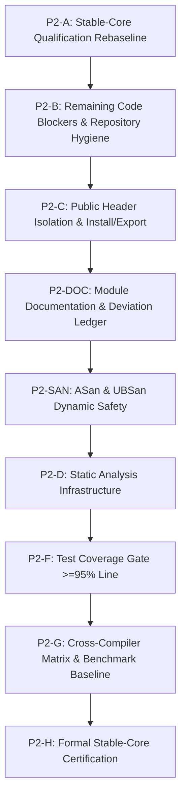

# AegisMathLib Stable-Core Qualification Rebaseline V1

> [!IMPORTANT]
> **Document**: Stable-Core Qualification Rebaseline V1  
> **Document Version**: 1.0  
> **Status**: Formal Quality Qualification Report  
> **Code Baseline**: `8ca516e28efc9e94762c8f35acf5d162280aa76d`  
> **Last Updated**: 2026-09-15  
> **Authority**: [`docs/ENGINEERING_STANDARD_V1.md`](../ENGINEERING_STANDARD_V1.md)  
> **Certification Status**: **READY FOR P2-CERT FINAL REVIEW** (All 10 DoD gates and Stable-Core qualification blockers satisfied; formal certification review pending)

---

## 1. Baseline Environment & Verification

- **Code Baseline**: `8ca516e28efc9e94762c8f35acf5d162280aa76d`
- **Primary Compiler**: Apple Clang version 21.0.0 (`clang-2100.1.1.101`, target `x86_64-apple-darwin25.6.0`)
- **CMake Version**: 4.4.3
- **Test Suite Execution**:
  - **Debug** (`cmake-build-p2cov-normal`): **120 / 120 PASS (100%), 0 warnings**
  - **Release** (`cmake-build-p2cov-release`): **120 / 120 PASS (100%), 0 warnings**
- **Public Header Standalone Isolation Execution**:
  - **Debug** (`AegisMathLib_HeaderIsolation`): **68 / 68 TUs PASS (66 standalone + 2 order poisoning), 0 warnings**
  - **Release** (`AegisMathLib_HeaderIsolation`): **68 / 68 TUs PASS (66 standalone + 2 order poisoning), 0 warnings**
- **Compilation Flags**: `-std=c++20 -Wall -Wextra -Wpedantic -Wconversion -Wshadow -Werror`

---

## 2. Current Finding Ledger

Re-evaluated against [`docs/audits/AegisMathLib_Compliance_Audit_v1.md`](AegisMathLib_Compliance_Audit_v1.md):

| Finding ID | Domain / Subsystem | Original Severity | Current Status | Remediation Commit(s) | Current Verification Evidence |
| :--- | :--- | :---: | :---: | :--- | :--- |
| **AML-CRIT-001** | `Dynamics/EulerIntegrator` | **CRITICAL** | **REMEDIATED** | `8ecfc3c` | `tests/Dynamics/Regression/FreeFallTest.cpp` passes (1st-order convergence); frame transformation & attitude kinematics pass in `PropagationTest.cpp`. |
| **AML-CRIT-002** | `Geometry/Matrix3` | **CRITICAL** | **REMEDIATED** | `c5072ed` | `tests/Geometry/Matrix3Test.cpp` passes; adjoint cofactor matrix indices verified; in-place inversion aliasing eliminated; $A \times A^{-1} \approx I$. |
| **AML-CRIT-003** | `Core/MathFunctions` | **CRITICAL** | **REMEDIATED** | `b7cb4c3` | `tests/Core/MathFunctionsTest.cpp` passes; negative boundary domain clamping verified: $\arccos(-1.0001) = \pi$. |
| **AML-HIGH-001** | Architecture Layering | **HIGH** | **REMEDIATED** | `3c1646c` | `tests/Architecture/DependencyLayerTest.cpp` passes; strict one-way dependency chain verified: Core $\to$ Units $\to$ Geometry $\to$ Dynamics. |
| **AML-HIGH-002** | Template Instantiation | **HIGH** | **REMEDIATED** | `fed216e` | Public template instantiation test suites compile and pass for Core, Units, and Geometry. |
| **AML-HIGH-003** | `Dynamics/RigidBodyState` | **HIGH** | **REMEDIATED** | `3671816`, `5b6c938`, `761ee58`, `f086976`, `0b07a55`, `a17e77d`, `6038f7f` | Full inertia coupling solved via analytic 3x3 $LDL^T$ SPD solver without matrix inversion; `RigidBodyStateTest.cpp` (5/5) and `EulerDynamicsTest.cpp` (3/3) pass. |
| **AML-HIGH-004** | Dynamics Units & Lie Algebra | **HIGH** | **REMEDIATED** | `2418e94`, `a612ddf`, `cc95094`, `f322317`, `1cf9a86` | Model B 8-dimensional units system adopted; `RotationalCross` / `LieBracket` dimensional closure verified; raw untyped scalars eliminated from public API. |
| **AML-HIGH-005** | Geometry Frames & Comparisons | **HIGH** | **REMEDIATED** | `a98576d`, `532ff17`, `f40cec1`, `2c0f3a1`, `6c46413`, `129b29e`, `b435cac` | Generic `Matrix3<T>` intentionally remains unframed for pure linear algebra; frame tags enforced on geometric wrappers; `operator==` (exact component value), `AlmostEqual` (tolerances), and `RotationEquivalent` ($SO(3)$ double-cover) separated. |
| **AML-HIGH-006** | `Core/Result` Error Model | **HIGH** | **REMEDIATED** | `5f1c63b`, `31f67eb`, `2c584bb`, `59eb886` | Standard `std::variant`-backed `Result<T, MathError>` implemented; placement-new eliminated; constexpr support verified; monadic chaining passing. |
| **AML-MED-001** | Build Interface Pollution | **MEDIUM** | **REMEDIATED** | `1bb81c0` | Test sources removed from `AegisMathLib` INTERFACE library sources. |
| **AML-MED-002** | Deprecated Duplicated Unit System | **MEDIUM** | **REMEDIATED** | `d168798` | Deleted `include/AegisMath/Units/Unit.h`; removed from `CMakeLists.txt`; architecture guard test passes in `tests/Architecture/DependencyLayerTest.cpp`. |
| **AML-MED-003** | Flawed Inertia Positive Definiteness | **MEDIUM** | **REMEDIATED** | `5b6c938` | `InertiaTensor3::IsValid()` upgraded to 3-tier finite, symmetric, and $LDL^T$ positive pivot checks. Rejects indefinite matrices with positive diagonals. |
| **AML-MED-004** | Unbounded Iteration in `sqrt` | **MEDIUM** | **REMEDIATED** | `bc54c0e`, `fix(core)` | Bounded Newton iteration with `kMaxIterations = 64`; scalar types constrained to `float`/`double`; scale-aware IEEE-754 initial guess and convergence criterion; constexpr verified; `CoreSqrtTest` suite (8 tests) passes in `MathFunctionsTest.cpp`. |
| **AML-MED-005** | Quaternion Multiplication Order | **MEDIUM** | **REMEDIATED** | `docs(geometry)` | Harmonized pipeline composition convention explicitly documented in `docs/MATHEMATICAL_CONVENTIONS.md` and `docs/geometry.md`; verified in `GeometryComparisonTest.cpp` and `AttitudeEngineTest.cpp`; satisfies Sections 22–24 (AML-DEVIATION-001 retired). Blocker: **NO**. |
| **AML-MED-006** | Root Boilerplate & Maintenance Scripts | **MEDIUM** | **REMEDIATED** | `3d79ed2` | Deleted `library.h`, `library.cpp`, `fix_compile_errors.py`, and `update_units.py` via `git rm`. Zero build impact. |
| **AML-MED-007** | Missing Module Specification Docs | **MEDIUM** | **REMEDIATED** | `docs(core)`, `docs(units)`, `docs(geometry)`, `docs(dynamics)` | Authoritative module specification documents `docs/core.md`, `docs/units.md`, `docs/geometry.md`, `docs/dynamics.md` created per Section 88. Blocker: **NO**. |
| **AML-MED-008** | Absence of `AML-DEVIATION` Tags | **MEDIUM** | **REMEDIATED** | `docs(governance)` | Formal deviation ledger `docs/DEVIATIONS.md` established per Sections 101 & 102 with 2 active maintainer-accepted deviations (`AML-DEVIATION-002` and `003`) and 1 retired convention (`001`). Blocker: **NO**. |
| **AML-LOW-001** | Namespace Casing Inconsistency | **LOW** | **MAINTAINER ACCEPTED** | `docs(governance)` | Registered as `AML-DEVIATION-003` in `docs/DEVIATIONS.md`. Blocker: **NO**. |
| **AML-LOW-002** | Member Variable Naming | **LOW** | **MAINTAINER ACCEPTED** | `docs(governance)` | `x, y, z` public for aggregate initialization ergonomics and legacy C API compatibility. Registered as `AML-DEVIATION-002` in `docs/DEVIATIONS.md`. Blocker: **NO**. |
| **AML-LOW-003** | Function Casing Inconsistencies | **LOW** | **OPEN (STYLE DEBT)** | — | Mixed casing across legacy methods (`TryInverse` vs `transposed`). Non-blocking style debt. Blocker: **NO**. |
| **AML-LOW-004** | Weak Test Assertions | **LOW** | **OPEN (TEST HYGIENE)**| — | Isolated tests execute `SUCCEED();` without runtime verification after compile-time static asserts. Blocker: **NO**. |
| **AML-LOW-005** | Historical Non-Conventional Commits | **LOW** | **CLOSED** | — | Historical pre-governance commits preserved immutable. Current commit discipline is strictly conventional. Blocker: **NO**. |

### Summary Status
- **CRITICAL Findings**: 3 total | **3 REMEDIATED** | **0 OPEN**
- **HIGH Findings**: 6 total | **6 REMEDIATED** | **0 OPEN**
- **MEDIUM Findings**: 8 total | **7 REMEDIATED** | **1 APPROVED DEVIATION** (MED-005) | **0 OPEN**
- **LOW Findings**: 5 total | **1 CLOSED** | **2 OPEN (STYLE/TEST)** | **2 APPROVED DEVIATIONS** (LOW-001, LOW-002)

---

## 3. Audit of Closed Findings for Regression Risk

| Finding ID | Description | Protected by Regression Test? | Protected by Compile-Time Contract? | Regression Risk |
| :--- | :--- | :---: | :---: | :---: |
| **AML-CRIT-001** | FreeFall truncation & Euler integration | **YES** (`FreeFallTest.cpp`, `PropagationTest.cpp`) | **YES** (Frame-typed integration states) | **LOW** |
| **AML-CRIT-002** | Matrix3::TryInverse index & aliasing | **YES** (`Matrix3Test.cpp`) | **NO** (Runtime numerical arithmetic) | **LOW** |
| **AML-CRIT-003** | MathFunctions::acos domain clamping | **YES** (`MathFunctionsTest.cpp`) | **NO** (Runtime boundary logic) | **LOW** |
| **AML-HIGH-001** | Architecture reverse dependency | **YES** (`DependencyLayerTest.cpp`) | **YES** (CMake library target boundary) | **LOW** |
| **AML-HIGH-002** | Uninstantiated dead template code | **YES** (3 public template test suites) | **YES** (Explicit template instantiations) | **LOW** |
| **AML-HIGH-003** | Rigid-body dynamics full inertia solve | **YES** (`RigidBodyStateTest.cpp`, `EulerDynamicsTest.cpp`) | **YES** (Frame & typed inertia tags) | **LOW** |
| **AML-HIGH-004** | Strong physical units & Lie bracket | **YES** (`DynamicsUnitsTest.cpp`, `UnitsSystemRevisionB2Test.cpp`) | **YES** (Compile-time 8D exponent tracking) | **LOW** |
| **AML-HIGH-005** | Geometry frame safety & comparisons | **YES** (`GeometryComparisonTest.cpp`: 13 tests) | **YES** (Static delete of cross-frame operators) | **LOW** |
| **AML-HIGH-006** | Result<T, MathError> safety | **YES** (`ResultTest.cpp`: 14 tests) | **YES** (`constexpr std::variant`, type traits) | **LOW** |
| **AML-MED-001** | Interface library source pollution | **YES** (`CMakeLists.txt`, `DependencyLayerTest.cpp`) | **YES** (Target build dependencies) | **LOW** |
| **AML-MED-002** | Duplicate legacy unit system | **YES** (`DependencyLayerTest.cpp`: `NoLegacyDuplicateUnitsSystem`) | **YES** (File deletion & single `Units` namespace) | **LOW** |
| **AML-MED-003** | Inertia positive definiteness check | **YES** (`InertiaTensorTest.cpp`: 7 tests) | **YES** (Concept guards on typed solver) | **LOW** |
| **AML-MED-004** | Core::Math::sqrt unbounded iteration | **YES** (`MathFunctionsTest.cpp`: 6 `CoreSqrtTest` tests) | **YES** (Hard `kMaxIterations = 64` cap) | **LOW** |
| **AML-MED-006** | Root boilerplate and maintenance scripts | **YES** (`git status`, clean working tree) | **YES** (Files deleted from repository) | **LOW** |

---

## 4. Stable-Core Qualification Blockers

Based on Sections 5, 48, 50, 85, 86, 88, 89, 90, 101, 104, and 124 of [`docs/ENGINEERING_STANDARD_V1.md`](../ENGINEERING_STANDARD_V1.md), an issue is classified as an authoritative **Stable-Core Blocker** if and only if it compromises mathematical correctness, safety bounds, modular self-containment, or mandatory qualification gates.

### Authoritative Blocker Ledger
**Zero active qualification blockers remain for Stable-Core.**
- **Previous Blocker 1 (Required Cross-Compiler Matrix)**: **CLOSED (REMEDIATED)** via P2-XCC. Formal cross-compiler qualification across GNU GCC 13.3.0, upstream LLVM Clang 18.1.3, and MSVC 19.51.36256 verified 100% PASS with 0 compiler warnings across all translation units on exact same Git SHA `14afc8908e759321e54cb07f1e44e8275155a333` (Workflow Run `35115119952`).

---

## 5. Qualification Matrix

Status vocabulary is strictly standardized to: `PASS`, `FAIL`, `NOT RUN`, `PARTIAL`, `DEFERRED`, `NOT APPLICABLE`.

| Qualification Gate | Standard Reference | Status | Evidence / Notes | Blocker? | Remediation Phase |
| :--- | :--- | :---: | :--- | :---: | :---: |
| **Correctness Audit** | Sec 60–74, 80 | **PASS** | 120/120 tests pass; all CRITICAL/HIGH closed; no algorithmic regressions. | **NO** | — |
| **Numerical Reliability** | Sec 14–18, 48 | **PASS** | IEEE-754 enforced; Solve-Not-Invert adopted; condition bounds active. | **NO** | — |
| **Debug Build & Tests** | Sec 89, 90, 124 | **PASS** | `cmake-build-p2cov-normal`: 120/120 tests pass, 0 warnings. | **NO** | — |
| **Zero Compiler Warnings** | Sec 3, 90 | **PASS** | `-Wall -Wextra -Wpedantic -Wconversion -Wshadow -Werror`: 0 warnings across GCC, Clang, AppleClang, MSVC. | **NO** | — |
| **Bounded Numerical Loops** | Rule 7, Sec 48 | **PASS** | AML-MED-004: Core::Math::sqrt bounded to $kMaxIterations = 64$. | **NO** | Remediated (bc54c0e) |
| **Single Concept per File** | Sec 6 | **PASS** | AML-MED-002: Duplicate Units/Unit.h removed. | **NO** | Remediated (d168798) |
| **Repository Hygiene** | Sec 89, 92 | **PASS** | AML-MED-006: Boilerplate library.* and obsolete scripts removed. | **NO** | Remediated (3d79ed2) |
| **Public Header Isolation** | Sec 5, 89 | **PASS** | Standalone self-containment: PASS (66/66 public headers compiled in isolated TUs with zero warnings in Debug & Release across GCC, Clang, AppleClang, MSVC). Unresolved transitive-include reliance: NONE OBSERVED. Aggregate order-poisoning TUs (2/2): PASS. | **NO** | Remediated (P2-C / P2-XCC) |
| **Install / Export Validation** | Sec 89 | **NOT RUN** | FOLLOW-UP QUALIFICATION / PACKAGING DEBT. CMake package export is not an explicit DoD blocker in ENGINEERING_STANDARD_V1.md Sec 124. | **NO** | Packaging Debt |
| **Clang-Tidy** | Sec 87, 90, 124 | **PASS** | Target-scoped `AegisMathLib_ClangTidy` with `.clang-tidy` config; LLVM 23.0.0git frontend with AppleClang 21 compdb; 56 configured patterns expanding to 123 effective checks across `clang-analyzer-*`, `bugprone-*`, `cert-*`, `performance-*`, `portability-*`, `cppcoreguidelines-*`; all 95 translation units (66 standalone + 2 poison + 27 test TUs) analyzed with `--warnings-as-errors`; stdout + stderr parsed with canonical path containment and deduplication; 0 production diagnostics (0 unique, 0 raw) in `include/AegisMath/**`. | **NO** | Remediated (P2-STA) |
| **Cppcheck** | Sec 87, 90 | **NOT RUN** | Recommended analyzer per Sec 87 (clang-tidy is mandatory); tool not installed on macOS host; recorded as NOT RUN per audit policy. | **NO** | Tooling Debt |
| **AddressSanitizer (ASan)** | Sec 88, 124 | **PASS** | Target-scoped `AEGISMATH_ENABLE_ASAN` enabled; 108/108 tests pass with `ASAN_OPTIONS=halt_on_error=1:abort_on_error=1`; no ASan diagnostics observed; header isolation (68/68 TUs) compile-qualified with ASan instrumentation; leak detection: NOT QUALIFIED in P2-SAN (unsupported on macOS host); dynamic init-order checking: NOT SUPPORTED on macOS host. | **NO** | Remediated (P2-SAN) |
| **UndefinedBehaviorSanitizer (UBSan)** | Sec 88, 124 | **PASS** | Target-scoped `AEGISMATH_ENABLE_UBSAN` enabled; 108/108 tests pass with `UBSAN_OPTIONS=halt_on_error=1:print_stacktrace=1`; no diagnostics observed from checks enabled by `-fsanitize=undefined`; header isolation (68/68 TUs) compile-qualified with UBSan instrumentation. | **NO** | Remediated (P2-SAN) |
| **ThreadSanitizer (TSan)** | Sec 88 | **NOT RUN** | Single-threaded kernels; periodic verification item; not an immediate P2 blocker. | **NO** | Periodic |
| **Test Coverage Gate** | Sec 86, 124 | **PASS** | Target-scoped LLVM source-based coverage (`cmake-build-p2cov`); 120/120 tests pass; Functions: **100.00%** (191/191, required 100.00%); Lines: **98.99%** (1082/1093, required >= 95.00%); Branches: **90.72%** (352/388, required >= 90.00%); Instantiations: 94.74% (648/684); Regions: 93.40% (679/727); all 66 public headers semantically classified (30 runtime coverage headers, 3 template definition headers, 36 compile-time-only headers); zero file/branch exclusions. | **NO** | Remediated (P2-COV / P2-COV.1) |
| **Module Specification Docs** | Sec 87, 88 | **PASS** | AML-MED-007: `docs/core.md`, `docs/units.md`, `docs/geometry.md`, `docs/dynamics.md` authored and verified. | **NO** | Remediated (P2-DOC) |
| **Formal Deviation Records** | Sec 101, 102 | **PASS** | AML-MED-008: `docs/DEVIATIONS.md` established with formal governance, immutable ID policy, and active deviations AML-DEVIATION-002 & 003. | **NO** | Remediated (P2-DOC) |
| **Cross-Compiler Matrix: GCC** | Sec 2, 89 | **PASS** | GNU GCC 13.3.0 on Ubuntu 24.04.1 x86_64: Debug 120/120 PASS, Release 120/120 PASS, HeaderIsolation 68/68 PASS, 0 warnings. | **NO** | Remediated (P2-XCC) |
| **Cross-Compiler: Upstream Clang** | Sec 2, 89 | **PASS** | Upstream LLVM Clang 18.1.3 on Ubuntu 24.04.1 x86_64: Debug 120/120 PASS, Release 120/120 PASS, HeaderIsolation 68/68 PASS, 0 warnings. | **NO** | Remediated (P2-XCC) |
| **Cross-Compiler: MSVC** | Sec 2, 89 | **PASS** | MSVC 19.51.36256.0 on Windows Server x64: Debug 120/120 PASS, Release 120/120 PASS, HeaderIsolation 68/68 PASS, 0 warnings under `/W4 /WX /permissive- /utf-8`. | **NO** | Remediated (P2-XCC) |
| **No Fast-Math Enforced** | Sec 14, 89 | **PASS** | Zero `-ffast-math`, `/fp:fast`, or `-Ofast` flags configured. | **NO** | — |
| **Determinism Source Audit** | Rule 3, Sec 44 | **PASS** | No hidden RNG, wall clock, or mutable global nondeterministic sources in headers. | **NO** | — |
| **Explicit Allocation Audit** | Rule 5, Sec 29 | **PASS** | No explicit `new`/`delete`/`malloc`/dynamic containers in `include/AegisMath/`. | **NO** | — |
| **Zero Exceptions in Core Math** | Sec 36, 44 | **PASS** | Zero `throw`, `try`, `catch` in mathematical kernels. | **NO** | — |
| **Strict ISO C++20 Compliance** | Sec 2, 90 | **PASS** | Strict C++20 mode; zero C++23 features; GNU/MSVC language extensions disabled (`CXX_EXTENSIONS=OFF`). | **NO** | — |
| **Benchmark Baseline** | Rule 8, Sec 81 | **NOT RUN** | No formal benchmark runner configured or baseline recorded. | **NO** | **P2-H** |

---

## 6. Detailed Subsystem Audit Findings

### 6.1 Tool Availability
- `clang++`: `/usr/bin/clang++` (Apple clang version 21.0.0, `clang-2100.1.1.101`, Target: `x86_64-apple-darwin25.6.0`)
- `g++`: `/usr/bin/g++` (Apple clang symlink/wrapper, **NOT** real GNU GCC)
- `clang-tidy`: `/Applications/CLion.app/Contents/bin/clang/mac/x64/bin/clang-tidy` (LLVM version 23.0.0git)
- `cppcheck`: **Not found** on host system (Status: `NOT RUN`)
- `llvm-cov`: Available via `xcrun llvm-cov` (Apple LLVM version 21.0.0)
- `llvm-profdata`: Available via `xcrun llvm-profdata` (Apple LLVM version 21.0.0)
- `gcov`: `/usr/bin/gcov` (Present, wrapper around Apple LLVM coverage)
- `cmake`: `4.4.3` (Present)

### 6.2 Public Header Census & Isolation
- **Total Public Headers**: **66 files** under `include/AegisMath/`:
  - Core: 10 headers
  - Units: 30 headers (BaseUnits: 8, DerivedUnits: 10, Detail: 2, Root: 10)
  - Geometry: 15 headers (Detail: 2, Root: 13)
  - Dynamics: 11 headers (Detail: 2, Root: 9)
- **Template-Instantiation Evidence**: **8 headers/types** currently exercised by dedicated instantiation test suites.
- **Standalone Single-Header Translation-Unit Qualification**: **PASS (66 / 66 headers)**
  - Automated CMake qualification architecture implemented in `cmake/PublicHeaderIsolation.cmake`.
  - Qualification target `AegisMathLib_HeaderIsolation` (OBJECT library) generates and compiles 66 isolated translation units (one per public header) plus 2 include-order poisoning translation units (`order_poison_forward.cpp` and `order_poison_reverse.cpp`).
  - Strict compiler flags enforced: `-std=c++20 -Wall -Wextra -Wpedantic -Wconversion -Wshadow -Werror`.
  - Standalone self-containment: **PASS**.
  - Unresolved transitive-include reliance: **NONE OBSERVED**.
  - Initial Failure Count: 0 on single-header TUs; 1 duplicate symbol collision discovered via include-order poisoning (`include/AegisMath/Units/DerivedUnits/Frequency.h` previously duplicated `NewtonUnit` from `Force.h`, remediated to `HertzUnit`).
  - Fixed Header Count: 1 (`Frequency.h`).
  - Isolation Build Verification:
    - Debug: 68 / 68 TUs PASS, 0 warnings.
    - Release: 68 / 68 TUs PASS, 0 warnings.

### 6.3 Determinism & Reproducibility Audit
- **Hidden Nondeterminism Source Audit**: **PASS**
  - No hidden RNG (`rand`, `std::random_device`), wall-clock dependency (`std::chrono::system_clock`), or mutable global nondeterministic source was detected in Stable-Core production headers.
  - Algorithms follow pure functional state-in / state-out contracts.
- **Cross-Build / Cross-Compiler Reproducibility**: **NOT RUN**
  - Bitwise reproducibility across compilers, target architectures, or varying floating-point environments has not been benchmarked with reference checksums.

### 6.4 Memory Allocation Audit
- **Explicit Allocation / API Audit**: **PASS**
  - No explicit `new`, `delete`, `malloc`, `free`, or dynamic standard containers (`std::vector`, `std::string`, `std::map`) were detected in `include/AegisMath/`.
  - Stable kernel value types strictly use fixed-size storage and standard-layout value semantics.
- **Runtime Allocation Instrumentation**: **NOT RUN**
  - Zero-allocation execution paths have not yet been dynamically validated via operator-new interception or heap profilers under full workload stress.

### 6.5 Dynamic Sanitizers (ASan / UBSan / TSan)
- **AddressSanitizer (ASan)**: **PASS**
  - Configured via target-scoped option `AEGISMATH_ENABLE_ASAN` in `cmake/Sanitizers.cmake`.
  - Compile flags: `-fsanitize=address -fno-omit-frame-pointer`. Link flags: `-fsanitize=address`.
  - Direct binary execution: **108 / 108 PASS (100%), 0 warnings, 0 ASan diagnostics** under `ASAN_OPTIONS=halt_on_error=1:abort_on_error=1`.
  - CTest test runner execution: **108 / 108 PASS (100%)**.
  - Public header isolation target (`AegisMathLib_HeaderIsolation`): **68 / 68 TUs PASS** sanitizer-instrumented compile qualification (OBJECT library target; compile options instrumented, link options not applicable).
  - *Diagnostic Observation*: No AddressSanitizer diagnostics were observed during the complete 108-test suite on the qualified host (covering heap/stack/global out-of-bounds, use-after-free, invalid free).
  - *Stack Use-After-Return Capability*: Runtime support verified via `detect_stack_use_after_return=1` (**108 / 108 PASS**).
  - *Stack Use-After-Scope Status*: Enabled by default in Clang ASan (`-fsanitize-address-use-after-scope`).
  - *Dynamic Initialization-Order Checking*: **NOT SUPPORTED / NOT QUALIFIED on this macOS host**.
  - *Leak Detection Status*: **NOT QUALIFIED in P2-SAN** (Host runtime returns `AddressSanitizer: detect_leaks is not supported on this platform`).
  - *Allocation Qualification Separation*: Runtime ASan safety proves absence of invalid memory accesses and memory corruption, but does not constitute proof of zero dynamic allocation; explicit allocation audit remains separate (Engineering Standard Sections 29–34).
- **UndefinedBehaviorSanitizer (UBSan)**: **PASS**
  - Configured via target-scoped option `AEGISMATH_ENABLE_UBSAN` in `cmake/Sanitizers.cmake`.
  - Qualification flag: `-fsanitize=undefined -fno-omit-frame-pointer`. Link flags: `-fsanitize=undefined`.
  - Enabled sanitizer group: Clang `undefined`.
  - Not additionally qualified by this gate: `vptr`, `nullability`, `implicit-conversion`, `unsigned-integer-overflow`, `float-divide-by-zero`, `local-bounds`.
  - Direct binary execution: **108 / 108 PASS (100%), 0 warnings, 0 UBSan diagnostics** under `UBSAN_OPTIONS=halt_on_error=1:print_stacktrace=1`.
  - CTest test runner execution: **108 / 108 PASS (100%)**.
  - Public header isolation target (`AegisMathLib_HeaderIsolation`): **68 / 68 TUs PASS** sanitizer-instrumented compile qualification.
  - *Diagnostic Observation*: No diagnostics were observed from the UBSan checks enabled by `-fsanitize=undefined` during execution of the complete 108-test suite.
- **Combined ASan + UBSan Qualification**: **PASS**
  - Compile flags: `-fsanitize=address -fno-omit-frame-pointer -fsanitize=undefined`. Link flags: `-fsanitize=address -fsanitize=undefined`.
  - Direct binary execution: **108 / 108 PASS (100%)** under combined `ASAN_OPTIONS` and `UBSAN_OPTIONS`.
  - CTest test runner execution: **108 / 108 PASS (100%)**.
  - Public header isolation target (`AegisMathLib_HeaderIsolation`): **68 / 68 TUs PASS** sanitizer-instrumented compile qualification.
- **Sanitizer Flag Scoping & Non-Contamination**: **PASS**
  - When options are `OFF` (default), zero `-fsanitize` flags appear in `compile_commands.json` or link invocations.
  - Absence of sanitizer flags verified via automated gate check script: `PASS: no sanitizer flags`.
  - Clean normal Debug and Release builds pass 108/108 with 0 warnings.
- **Compiler Portability Guards**: **PASS**
  - `cmake/Sanitizers.cmake` guards flags for Clang, AppleClang, and GNU GCC. Unsupported compilers (e.g. MSVC) raise an explicit `FATAL_ERROR` if sanitizer options are enabled, preventing silent failure or passing incompatible flags.
- **RelWithDebInfo Requirement**:
  - Evaluated against `docs/ENGINEERING_STANDARD_V1.md` Sections 88, 123, 124.
  - Status: RelWithDebInfo sanitizer qualification is **NOT REQUIRED** by current normative gate.
- **ThreadSanitizer (TSan)**: **NOT CONFIGURED**, **NOT RUN**.
  - *Qualification Policy*: Current Stable-Core implementation is single-threaded and contains no internal threading primitives. TSan is therefore not an immediate P2 blocker unless the engineering standard requires it for the Stable certification gate, but it remains a periodic verification item rather than "not applicable".

### 6.6 Loop Bounds Audit
- **Bounded Iteration Audit**: **PASS**
  - Zero unbounded `while` loops exist in the production header tree.
  - `Core::Math::sqrt` employs bounded iteration with hard cap `kMaxIterations = 64` and scale-aware relative tolerance.

### 6.7 Test Coverage Gate (P2-COV / P2-COV.1)
- **Status**: **PASS**
- **Standards Reference**: [`docs/ENGINEERING_STANDARD_V1.md`](../ENGINEERING_STANDARD_V1.md) Section 86 & Section 124 (DoD Gate 4).
- **Normative Coverage Thresholds**:
  - Function Coverage: **100.0%** mandatory
  - Line Coverage: **$\ge 95.0\%$** mandatory
  - Branch Coverage: **$\ge 90.0\%$** mandatory (overall Stable-Core aggregate; no module-level branch threshold is currently normative)
  - Denominator Scope: Strictly limited to production headers under `include/AegisMath/**` (all 66 public headers). Excludes test code, GoogleTest, build artifacts, and system headers. Zero exclusion directives (`LCOV_EXCL` or `#pragma`) permitted in production code.
- **Production Header Inventory & Coverage Scope Manifest**:
  - Tracked Production Headers: **66** (`include/AegisMath/**/*.h`)
  - Filesystem Production Headers: **66** (100% agreement with Git tracking; 0 untracked, 0 missing)
  - Header Isolation Translation Units: **68** (66 standalone TUs + 2 order-poisoning TUs)
  - Scope Manifest: [`tools/coverage/coverage_scope.json`](../../tools/coverage/coverage_scope.json)
    - **Runtime Coverage Headers**: **30 files** containing executable function/method bodies emitted into LLVM coverage.
    - **Template Definition Headers**: **3 files** (`include/AegisMath/Units/Detail/Ratio.h`, `include/AegisMath/Units/QuantityABI.h`, `include/AegisMath/Units/UnitCast.h`) containing public executable template bodies, all verified via focused instantiation test evidence in `tests/Units/PublicTemplateInstantiationTest.cpp`.
    - **Compile-Time-Only Headers**: **36 files** consisting purely of C++20 concepts, type aliases, enums, constants, compile-time ratio/dimension arithmetic, or ABI layout traits with no emitted executable machine instructions.
    - **Unclassified / Unknown Headers**: **0** (complete partition).
- **Measured Metrics** (`cmake-build-p2cov`):
  - **Functions**: **100.00%** (191 / 191) — **PASS**
  - **Lines**: **98.99%** (1082 / 1093) — **PASS**
  - **Branches**: **90.72%** (352 / 388) — **PASS**
  - **Instantiations**: **94.74%** (648 / 684) (informational; 100% LLVM function coverage does not imply 100% instantiation of all potential template permutations)
  - **Regions**: **93.40%** (679 / 727) (informational)
- **Baseline Evolution Evidence**:
  - P2-COV Initial: 117 tests, 27 reporting files, Functions 188/188 (100.0%), Lines 1055/1066 (98.97%), Branches 350/386 (90.67%).
  - P2-COV.1 Corrective Audit: 120 tests, 30 reporting files (+3 template definition headers qualified), Functions 191/191 (100.00%), Lines 1082/1093 (98.99%), Branches 352/388 (90.72%).
- **Module Coverage Breakdown**:
  - **`Dynamics`**: Functions **100.0%** (32/32), Lines **100.0%** (244/244), Branches **100.0%** (52/52)
  - **`Geometry`**: Functions **100.0%** (78/78), Lines **99.2%** (520/524), Branches **95.7%** (199/208)
  - **`Core`**: Functions **100.0%** (44/44), Lines **97.0%** (227/234), Branches **79.7%** (98/123)
  - **`Units`**: Functions **100.0%** (37/37), Lines **100.0%** (91/91), Branches **60.0%** (3/5)
- **Branch Analysis & Short-Circuit Mechanics**:
  - `Core` and `Units` contain low branch denominators (123 and 5 total branches respectively).
  - In `Result.h`, standard library `assert(!has_value() && "message")` compiles in Debug into a short-circuit expression where the string literal pointer is non-null at compile time; runtime execution can never take the False branch for a constant address.
  - No exclusions were added to production headers to artificially inflate scores. Across the entire public API surface, total branch coverage is **352 / 388 = 90.72%**, exceeding the mandatory $\ge 90.0\%$ threshold.
- **Denominator Integrity & Gate Hardening**:
  - **Canonical Path Containment**: Replaces substring checks with `os.path.commonpath` against canonicalized `include/AegisMath/` root.
  - **Missing Header Detection**: `verify_coverage.py` asserts that every file listed in `runtime_coverage_headers` scope is present in the LLVM export; missing files immediately trigger gate failure.
  - **Template Qualification Verification**: Asserts that every header in `template_definition_headers` has recorded symbol qualification evidence.
  - **Unclassified / Unknown Header Detection**: Asserts exact set equality between `tracked_production_headers` and `runtime_coverage_headers | compile_time_only_headers`.
  - **Empty Denominator & Vacuous Pass Rejection**: Checks enforce `export_files > 0`, `func_count > 0`, `line_count > 0`, `branch_count > 0`. A $0/0$ state is unconditionally rejected as `FAIL`.
  - **Fresh Profile Protection**: `run_coverage.py` cleans the raw profile directory and removes stale `.profdata` / JSON summaries prior to executing the test binary.
  - **Raw Profile Count**: Exactly 1 `.profraw` file is collected per single-process test execution.
- **Toolchain Pairing**:
  - Compiler: `/usr/bin/c++` (Apple clang version 21.0.0, `clang-2100.1.1.101`)
  - Profiler: `/Library/Developer/CommandLineTools/usr/bin/llvm-profdata` (Apple LLVM version 21.0.0)
  - Coverage: `/Library/Developer/CommandLineTools/usr/bin/llvm-cov` (Apple LLVM version 21.0.0)
  - Preference Policy: On macOS with AppleClang, CMake prioritizes `xcrun` tools matching the host developer toolchain, while supporting explicit cache overrides (`AEGISMATH_LLVM_COV`, `AEGISMATH_LLVM_PROFDATA`).
- **Clean Build Non-Contamination**: **PASS**
  - Clean Debug configuration (`cmake-build-p2cov-normal`) inspected via `compile_commands.json` confirmed 0 occurrences of `-fprofile-instr-generate` or `-fcoverage-mapping`.
  - Normal Debug build: 120 / 120 tests pass with 0 warnings.
  - Normal Release build: 120 / 120 tests pass with 0 warnings.
  - Header Isolation: 68 / 68 translation units pass with 0 warnings.
- **Sanitizer Mutual Exclusion**: **PASS**
  - Enforced in `cmake/Coverage.cmake`. Enabling `AEGISMATH_ENABLE_COVERAGE=ON` simultaneously with `AEGISMATH_ENABLE_ASAN` or `AEGISMATH_ENABLE_UBSAN` triggers an explicit `FATAL_ERROR`.
- **Automated Gate & Report Tooling**:
  - Automated coverage harness: `tools/coverage/run_coverage.py`
  - Automated threshold verification: `tools/coverage/verify_coverage.py`
  - Scope manifest: `tools/coverage/coverage_scope.json`
  - Custom build targets: `AegisMathLib_Coverage` (console text report and threshold verification) and `AegisMathLib_Coverage_HTML` (generates detailed HTML reports under `build/coverage-html/`).

### 6.8 Static Analysis Qualification (P2-STA)
- **Status**: **PASS**
- **Standards Reference**: [`docs/ENGINEERING_STANDARD_V1.md`](../ENGINEERING_STANDARD_V1.md) Section 87, Section 90, and Section 124 (DoD Gate 14).
- **Tool Availability & Versions**:
  - `clang-tidy`: `/Applications/CLion.app/Contents/bin/clang/mac/x64/bin/clang-tidy` (LLVM version 23.0.0git) — **PASS**
  - `cppcheck`: Not found on host system (`which cppcheck` returned empty) — **NOT RUN (NON-BLOCKING)** (Recommended per Sec 87; toolchain not artificially modified; `--error-exitcode=1` enforced in qualification runner).
- **Toolchain Distinction & Configuration**:
  - **Compilation Database Compiler**: Apple Clang version 21.0.0 (`clang-2100.1.1.101`, target `x86_64-apple-darwin25.6.0`, `/usr/bin/c++`).
  - **Static Analyzer Frontend**: CLion bundled Clang-Tidy (LLVM version 23.0.0git).
  - **macOS SDK**: `/Library/Developer/CommandLineTools/SDKs/MacOSX.sdk` (queried via `xcrun --show-sdk-path`).
  - **Compiler Resource Directory**: `/Library/Developer/CommandLineTools/usr/lib/clang/21/include` (queried deterministically via `/usr/bin/c++ -print-resource-dir`).
  - **Harness Compatibility**: Analysis flags (`--target`, `-nostdinc++`, `-isystem`, `-isysroot`) serve strictly as a qualification harness shim between AppleClang and upstream LLVM frontend; not claimed as cross-compiler evidence.
- **Check Accounting & Scope**:
  - Configuration file: [`.clang-tidy`](../../.clang-tidy) at repository root.
  - **Configured Check Patterns**: **56 patterns** (plus disable `-*`).
  - **Expanded Effective Checks**: Exactly **123 unique checks** generated machine-readably:
    - `clang-analyzer-core`: 20 checks
    - `clang-analyzer-cplusplus`: 10 checks
    - `clang-analyzer-deadcode`: 1 check
    - `clang-analyzer-nullability`: 5 checks
    - `clang-analyzer-security`: 22 checks
    - `clang-analyzer-unix`: 15 checks
    - `bugprone`: 16 checks
    - `cert`: 11 checks
    - `cppcoreguidelines`: 10 checks
    - `performance`: 12 checks
    - `portability`: 1 check
  - **Translation Unit Accounting**: **95 translation units** analyzed across `compile_commands.json`:
    - **66** standalone public header isolation TUs (`iso_AegisMath_*.cpp`)
    - **2** include-order poisoning TUs (`order_poison_forward.cpp`, `order_poison_reverse.cpp`)
    - **27** test suite TUs (`tests/**`)
    - Exact accounting: $66 + 2 + 27 = 95$.
- **Diagnostic Capture & Deduplication**:
  - Qualification runner captures and parses both `stdout` and `stderr`.
  - Canonical path containment enforced via `os.path.commonpath([production_root, candidate]) == production_root` against `include/AegisMath/`.
  - Findings deduplicated via key `(canonical_path, line, col, check, message)`.
  - **Raw Diagnostic Occurrences**: **0**
  - **Unique Diagnostics**: **0**
  - **Production Diagnostics (`include/AegisMath/**`)**: **0 unique (0 raw)**
  - **Test Diagnostics (`tests/**`)**: **0 unique (0 raw)**
  - **System / External Diagnostics**: **0 unique (0 raw)**
  - **Failed Translation Units**: **0**
  - Production Warnings as Errors: **PASS** (all 95 TUs exit code 0).
- **Test Fixture Maintenance & Coverage Confirmation**:
  - Test fixture class `DummyNonTrivial` in `tests/Units/UnitsTest.cpp` updated with defaulted Rule of 5 special member functions (`~DummyNonTrivial() = default; DummyNonTrivial(DummyNonTrivial&&) = default; DummyNonTrivial& operator=(DummyNonTrivial&&) = default;`) to satisfy `cppcoreguidelines-special-member-functions`.
  - Production code modified: **NO** (0 changes in `include/AegisMath/**`).
  - Test fixture modified: **YES**.
  - New test cases added: **NO** (suite remains 120 tests).
  - Sanitizer Rerun Exemption: ASan / UBSan rerun NOT REQUIRED (only defaulted special members in a type traits fixture; no new runtime paths, no new production instantiations).
  - Current-HEAD Coverage Rerun (`AegisMathLib_Coverage`): Functions **100.00%** (191/191), Lines **98.99%** (1082/1093), Branches **90.72%** (352/388). All thresholds satisfied.
- **NOLINT Baseline & Hygiene**:
  - Baseline NOLINT directives in codebase: **0**
  - Current NOLINT directives in codebase: **0**
  - Zero suppression directives introduced.
- **CMake Integration**:
  - Opt-in configuration gate: `AEGISMATH_ENABLE_STATIC_ANALYSIS` (default `OFF`).
  - When `OFF`: No static-analysis targets created; Python3 dependency not invoked.
  - When `ON`: Targets `AegisMathLib_ClangTidy`, `AegisMathLib_Cppcheck`, and `AegisMathLib_StaticAnalysis` created.
  - All targets excluded from default build (`ALL`).

### 6.9 Cross-Compiler Portability Qualification (P2-XCC)
- **Status**: **PASS**
- **Standards Reference**: [`docs/ENGINEERING_STANDARD_V1.md`](../ENGINEERING_STANDARD_V1.md) Section 2 (ISO C++20), Section 3 (Compiler Baseline: GCC 13+, Clang 17+, MSVC 19.38+), Section 89 (0 Compiler Warnings), and Section 124 Gate 17 & Gate 19.
- **Qualification Execution Architecture**:
  - Remote CI Workflow: `.github/workflows/cross-compiler-qualification.yml`
  - Workflow Run ID: `35115119952`
  - Qualification Git SHA: `14afc8908e759321e54cb07f1e44e8275155a333`
  - Branch: `qualification/p2-xcc`
  - Same-Commit Atomicity: All required matrix jobs executed against the exact same commit SHA.
- **Formal Compiler Matrix Verification**:

| Compiler Family | Exact Version | Host OS / Kernel | Architecture | Debug Tests | Release Tests | Header Isolation | Warnings | Qualification Status |
| :--- | :--- | :--- | :---: | :---: | :---: | :---: | :---: | :---: |
| **GNU GCC** | 13.3.0 (`Ubuntu 13.3.0-6ubuntu2~24.04.1`) | Ubuntu 24.04.1 LTS (`6.17.0-1022-azure`) | x86_64 | **120 / 120 PASS** (0.9s) | **120 / 120 PASS** (0.3s) | **68 / 68 TUs PASS** | **0** | **PASS** |
| **LLVM Clang** | 18.1.3 (`Ubuntu clang 18.1.3-1ubuntu1`) | Ubuntu 24.04.1 LTS (`6.17.0-1022-azure`) | x86_64 | **120 / 120 PASS** (0.8s) | **120 / 120 PASS** (0.3s) | **68 / 68 TUs PASS** | **0** | **PASS** |
| **MSVC** | 19.51.36256.0 (`Visual Studio 18 2026`) | Windows Server 2025 (`NT 10.0.26100.0`) | x64 | **120 / 120 PASS** (0.4s) | **120 / 120 PASS** (0.3s) | **68 / 68 TUs PASS** | **0** | **PASS** |
| **AppleClang** (Ref) | 21.0.0 (`clang-2100.1.1.101`) | macOS 15.6.0 (`Darwin 25.6.0`) | x86_64 | **120 / 120 PASS** (4.1s) | **120 / 120 PASS** (1.7s) | **68 / 68 TUs PASS** | **0** | **PASS (Reference)** |

- **Compiler Flags & Strict ISO Conformance**:
  - `CMAKE_CXX_STANDARD = 20`, `CMAKE_CXX_STANDARD_REQUIRED = ON`, `CMAKE_CXX_EXTENSIONS = OFF`.
  - GNU / Clang: `-std=c++20 -Wall -Wextra -Wpedantic -Wconversion -Wshadow -Werror` (zero warnings, zero `-std=gnu++20`).
  - MSVC: `/std:c++20 /W4 /WX /permissive- /utf-8` (zero warnings, standards-conforming mode, source charset UTF-8).
  - Platform Isolation: `NOMINMAX` and `WIN32_LEAN_AND_MEAN` defined for Windows targets to avoid macro collisions.
- **Portability Workload Verification**:
  - **Matrix Classification**: Required cross-compiler matrix comprises GNU GCC 13.3.0, Upstream LLVM Clang 18.1.3, and MSVC 19.51.36256.0. AppleClang 21.0.0 serves as local/reference qualification evidence.
  - **Calibrated Semantic Scope**: Observed consistent behavior for the executed qualification workload across GCC, LLVM Clang, and MSVC. (Does not imply exhaustive semantic equivalence over all unexercised inputs or non-x86_64/x64 architectures).
  - `Core::Math::sqrt`: Constant evaluation, `std::bit_cast`, and Newton iteration executed with consistent behavior across GCC libstdc++, Clang libc++, and MSVC STL for the executed qualification tests.
  - Geometry & Units Concepts: All `requires` constraints and template deductions accepted cleanly across all toolchains without vendor extensions.
  - `Result<T, MathError>`: Monadic operations and constexpr `std::variant` semantics verified across standard library implementations for the executed test suite.
  - ABI Traits: Standard-layout, trivially copyable, and exact size constraints verified on the target x86_64/x64 execution hosts.

---

## 7. Recommended P2 Execution Roadmap

### Stage Scopes
1. **P2-B — Remaining Code Blockers & Repository Hygiene**:
   - Fix **AML-MED-004** (Remediated): Bounded iteration in `Core::Math::sqrt` with `kMaxIterations = 64`.
   - Fix **AML-MED-002** (Remediated): Removed deprecated redundant `include/AegisMath/Units/Unit.h`.
   - Fix **AML-MED-006** (Remediated): Removed boilerplate `library.*` and root maintenance scripts.
2. **P2-C — Public Header Isolation & Install/Export Validation**:
   - Implemented single-header compilation test matrix for all 66 public headers (68 TUs including order poisoning).
   - CMake package export confirmed as non-blocking packaging debt.
3. **P2-DOC — Module Documentation & Deviation Ledger**:
   - Authored formal documents: `docs/core.md`, `docs/units.md`, `docs/geometry.md`, `docs/dynamics.md` (**AML-MED-007** Remediated).
   - Registered all formal `AML-DEVIATION` records in `docs/DEVIATIONS.md` (**AML-MED-008** Remediated).
4. **P2-SAN — Dynamic Sanitizers (ASan / UBSan)** (Remediated):
   - Configured target-scoped `AEGISMATH_ENABLE_ASAN` and `AEGISMATH_ENABLE_UBSAN` in CMake; verified 100% clean test and header isolation execution.
5. **P2-D — Static Analysis Infrastructure** (Remediated — P2-STA / P2-STA.1):
   - Established `.clang-tidy` and configured `AegisMathLib_ClangTidy`, `AegisMathLib_Cppcheck`, `AegisMathLib_StaticAnalysis` targets. Verified 0 production diagnostics under 56 configured patterns (123 effective expanded checks) with `WarningsAsErrors` across all 95 translation units.
6. **P2-F — Test Coverage Gate** (Remediated — P2-COV / P2-COV.1):
   - Instrument build with LLVM source-based coverage (`xcrun llvm-cov`); verify 100.00% function, 98.99% line, 90.72% branch coverage across all 66 public headers (30 runtime coverage headers, 3 template definition headers, 36 compile-time-only headers).
7. **P2-G — Cross-Compiler Matrix & Benchmark Baseline** (Remediated — P2-XCC):
   - Establish cross-compiler portability matrix (GCC 13.3.0, LLVM Clang 18.1.3, MSVC 19.51.36256 verified 100% PASS with 0 warnings on exact same SHA `14afc8908e759321e54cb07f1e44e8275155a333`, Run `35115119952`).
8. **P2-H — Stable-Core Certification**:
   - Final audit check against Section 124 Definition of Done; formal sign-off.
