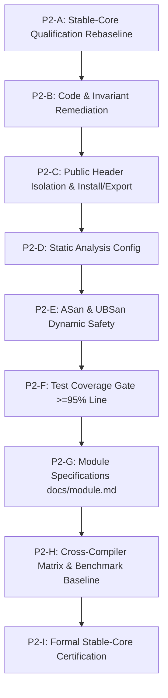

# AegisMathLib Stable-Core Qualification Rebaseline V1

> [!IMPORTANT]
> **Governance Authority**: [`docs/ENGINEERING_STANDARD_V1.md`](../ENGINEERING_STANDARD_V1.md)
> **Baseline Commit**: `b435cac09748fca4292f70f7b44830084d9feb8b`
> **Certification Status**: **NOT CERTIFIED** (Pending remaining Medium findings, static analysis, sanitizers, and coverage verification)
> **Date**: 2026-09-15

---

## 1. Baseline Environment & Verification

- **Repository HEAD**: `b435cac09748fca4292f70f7b44830084d9feb8b`
- **Branch Tracking**: `main == origin/main` (Working tree clean)
- **Primary Compiler**: Apple Clang version 21.0.0 (`clang-2100.1.1.101`, target `x86_64-apple-darwin25.6.0`)
- **CMake Version**: 4.4.3
- **Test Suite Execution**:
  - **Debug** (`cmake-build-p2a-debug`): **97 / 97 PASS (100%), 0 warnings**
  - **Release** (`cmake-build-quaternion-invariant-release`): **97 / 97 PASS (100%), 0 warnings**
- **Compilation Flags**: `-std=c++20 -Wall -Wextra -Wpedantic -Wconversion -Wshadow -Werror`

---

## 2. Current Finding Ledger

Re-evaluated against [`docs/audits/AegisMathLib_Compliance_Audit_v1.md`](AegisMathLib_Compliance_Audit_v1.md):

| Finding ID | Domain / Subsystem | Original Severity | Current Status | Remediation Commit(s) | Current Verification Evidence |
| :--- | :--- | :---: | :---: | :--- | :--- |
| **AML-CRIT-001** | `Dynamics/EulerIntegrator` | **CRITICAL** | **REMEDIATED** | `8ecfc3c` | `tests/Dynamics/Regression/FreeFallTest.cpp` passes (1st-order convergence); frame transformation & attitude kinematics pass in `PropagationTest.cpp`. |
| **AML-CRIT-002** | `Geometry/Matrix3` | **CRITICAL** | **REMEDIATED** | `c5072ed` | `tests/Geometry/Matrix3Test.cpp` passes; adjoint cofactor matrix indices verified; in-place inversion aliasing eliminated; $A \times A^{-1} \approx I$. |
| **AML-CRIT-003** | `Core/MathFunctions` | **CRITICAL** | **REMEDIATED** | `b7cb4c3` | `tests/Core/MathFunctionsTest.cpp` passes; negative boundary domain clamping verified: $\arccos(-1.0001) = \pi$. |
| **AML-HIGH-001** | Architecture Layering | **HIGH** | **REMEDIATED** | `3c1646c` | `tests/Architecture/DependencyLayerTest.cpp` passes; strict one-way dependency chain verified: Core $\to$ Units $\to$ Geometry $\to$ Dynamics. |
| **AML-HIGH-002** | Template Instantiation | **HIGH** | **REMEDIATED** | `fed216e` | Public template instantiation test suites compile and pass for Core, Units, and Geometry. |
| **AML-HIGH-003** | `Dynamics/RigidBodyState` | **HIGH** | **REMEDIATED** | `3671816`, `5b6c938`, `761ee58`, `f086976`, `0b07a55`, `a17e77d`, `6038f7f` | Full inertia coupling solved via analytic 3x3 $LDL^T$ SPD solver without matrix inversion; `RigidBodyStateTest.cpp` (5/5) and `EulerDynamicsTest.cpp` (3/3) pass. |
| **AML-HIGH-004** | Dynamics Units & Lie Algebra | **HIGH** | **REMEDIATED** | `2418e94`, `a612ddf`, `cc95094`, `f322317`, `1cf9a86` | Model B 8-dimensional units system adopted; `RotationalCross` / `LieBracket` dimensional closure verified; raw untyped scalars eliminated from public API. |
| **AML-HIGH-005** | Geometry Frames & Comparisons | **HIGH** | **REMEDIATED** | `a98576d`, `532ff17`, `f40cec1`, `2c0f3a1`, `6c46413`, `129b29e`, `b435cac` | Generic `Matrix3<T>` intentionally remains unframed for pure linear algebra; frame tags enforced on geometric wrappers; `operator==` (exact component value), `AlmostEqual` (tolerances), and `RotationEquivalent` ($SO(3)$ double-cover) separated. |
| **AML-HIGH-006** | `Core/Result` Error Model | **HIGH** | **REMEDIATED** | `5f1c63b`, `31f67eb`, `2c584bb`, `59eb886` | Standard `std::variant`-backed `Result<T, MathError>` implemented; placement-new eliminated; constexpr support verified; monadic chaining passing. |
| **AML-MED-001** | Build Interface Pollution | **MEDIUM** | **REMEDIATED** | `1bb81c0` | Test sources removed from `AegisMathLib` INTERFACE library sources. |
| **AML-MED-002** | Deprecated Duplicated Unit System | **MEDIUM** | **OPEN** | — | `include/AegisMath/Units/Unit.h` defines redundant duplicate `AegisMath::Quantity` conflicting with `AegisMath::Units::Quantity`. |
| **AML-MED-003** | Flawed Inertia Positive Definiteness | **MEDIUM** | **REMEDIATED** | `5b6c938` | `InertiaTensor3::IsValid()` upgraded to 3-tier finite, symmetric, and $LDL^T$ positive pivot checks. Rejects indefinite matrices with positive diagonals. |
| **AML-MED-004** | Unbounded Iteration in `sqrt` | **MEDIUM** | **OPEN** | — | `include/AegisMath/Core/Math.h:19` while loop has no hard iteration cap, violating Rule 7. |
| **AML-MED-005** | Quaternion Multiplication Order | **MEDIUM** | **DESIGN DEBT / DEVIATION** | — | Pipeline composition order $R_{AB} * R_{BC} \to R_{AC}$ harmonized across `RotationMatrix3` and `Quaternion`, documented in conventions; requires formal `AML-DEVIATION` registration. |
| **AML-MED-006** | Root Boilerplate & Maintenance Scripts | **MEDIUM** | **OPEN (LOW RISK)** | — | `library.h`, `library.cpp`, `fix_compile_errors.py`, `update_units.py` reside in source root. |
| **AML-MED-007** | Missing Module Specification Docs | **MEDIUM** | **OPEN** | — | No `docs/core.md`, `docs/units.md`, `docs/geometry.md`, `docs/dynamics.md` exist under `docs/`. |
| **AML-MED-008** | Absence of `AML-DEVIATION` Tags | **MEDIUM** | **OPEN** | — | Zero formal `AML-DEVIATION` tags registered across the repository. |
| **AML-LOW-001** | Namespace Casing Inconsistency | **LOW** | **OPEN (ROADMAP)** | — | `AegisMath` vs `aegis::math`. Breaking change deferred to v2.0 or documented deviation. |
| **AML-LOW-002** | Member Variable Naming | **LOW** | **DESIGN DEBT** | — | `x, y, z` public for standard-layout ABI. Documented in conventions; requires `AML-DEVIATION`. |
| **AML-LOW-003** | Function Casing Inconsistencies | **LOW** | **OPEN (STYLE DEBT)** | — | Mixed casing across legacy methods (`TryInverse` vs `transposed`). Non-blocking style debt. |
| **AML-LOW-004** | Weak Test Assertions | **LOW** | **OPEN (TEST HYGIENE)**| — | Isolated tests execute `SUCCEED();` without runtime verification after compile-time static asserts. |
| **AML-LOW-005** | Historical Non-Conventional Commits | **LOW** | **HISTORICAL (CLOSED)**| — | Historical pre-governance commits preserved immutable. Current commit discipline is strictly conventional. |

### Summary Status
- **CRITICAL Findings**: 3 total | **3 REMEDIATED** | **0 OPEN**
- **HIGH Findings**: 6 total | **6 REMEDIATED** | **0 OPEN**
- **MEDIUM Findings**: 8 total | **2 REMEDIATED** | **5 OPEN** | **1 DESIGN DEBT / DEVIATION**
- **LOW Findings**: 5 total | **1 HISTORICAL CLOSED** | **4 OPEN / ROADMAP**

---

## 3. Audit of Closed Findings for Regression Risk

| Finding ID | Description | Protected by Regression Test? | Protected by Compile-Time Contract? | Regression Risk |
| :--- | :--- | :---: | :---: | :---: |
| **AML-CRIT-001** | FreeFall truncation & Euler integration | **YES** (`FreeFallTest.cpp`, `PropagationTest.cpp`) | **YES** (Frame-typed integration states) | **LOW** |
| **AML-CRIT-002** | Matrix3::TryInverse index & aliasing | **YES** (`Matrix3Test.cpp`) | **NO** (Runtime numerical arithmetic) | **LOW** |
| **AML-CRIT-003** | MathFunctions::acos domain clamping | **YES** (`MathFunctionsTest.cpp`) | **NO** (Runtime boundary logic) | **LOW** |
| **AML-HIGH-001** | Architecture reverse dependency | **YES** (`DependencyLayerTest.cpp`) | **YES** (CMake library target boundary) | **LOW** |
| **AML-HIGH-002** | Uninstantiated dead template code | **YES** (3 public template test suites) | **YES** (Explicit template instantiations) | **LOW** |
| **AML-HIGH-003** | Rigid-body dynamics full inertia solve | **YES** (`RigidBodyStateTest.cpp`, `EulerDynamicsTest.cpp`) | **YES** (Frame & typed inertia tags) | **LOW** |
| **AML-HIGH-004** | Strong physical units & Lie bracket | **YES** (`DynamicsUnitsTest.cpp`, `UnitsSystemRevisionB2Test.cpp`) | **YES** (Compile-time 8D exponent tracking) | **LOW** |
| **AML-HIGH-005** | Geometry frame safety & comparisons | **YES** (`GeometryComparisonTest.cpp`: 13 tests) | **YES** (Static delete of cross-frame operators) | **LOW** |
| **AML-HIGH-006** | Result<T, MathError> safety | **YES** (`ResultTest.cpp`: 14 tests) | **YES** (`constexpr std::variant`, type traits) | **LOW** |
| **AML-MED-001** | Interface library source pollution | **YES** (`CMakeLists.txt`, `DependencyLayerTest.cpp`) | **YES** (Target build dependencies) | **LOW** |
| **AML-MED-003** | Inertia positive definiteness check | **YES** (`InertiaTensorTest.cpp`: 7 tests) | **YES** (Concept guards on typed solver) | **LOW** |

---

## 4. Stable-Core Qualification Blockers

Based on Sections 48, 50, 86, 88, 101, 104, and 124 of [`docs/ENGINEERING_STANDARD_V1.md`](../ENGINEERING_STANDARD_V1.md), an issue is classified as a **Stable-Core Blocker** if and only if it compromises:
1. **Mathematical correctness or numerical stability**.
2. **Hard iteration bounds** (Rule 7: Unbounded iteration in critical kernels is strictly prohibited).
3. **Core API ambiguity or redundant conflicting types** (Section 6: No redundant duplicate concepts).
4. **Formal deviation governance** (Section 101/102: Zero undocumented deviations permitted).
5. **Formal module specifications** (Section 87/88: Complete module documentation required for DoD).
6. **Public header self-containment** (Every public header must compile independently).
7. **Sanitizer and dynamic safety verification** (ASan/UBSan clean execution).
8. **Test coverage thresholds** (100% function, $\ge 95\%$ line, $\ge 90\%$ branch).

Cosmetic naming (`AML-LOW-001`, `AML-LOW-003`) and historical git commits (`AML-LOW-005`) are explicitly **non-blockers**.

### Current Identified Stable-Core Blockers
1. **AML-MED-004**: Unbounded `while` iteration in `Core::Math::sqrt`.
2. **AML-MED-002**: Redundant duplicate `Units/Unit.h` header and conflicting `Quantity` definition.
3. **AML-MED-008**: Zero formal `AML-DEVIATION` tags for documented architectural choices.
4. **AML-MED-007**: Absence of formal `docs/<module>.md` module specification documents.
5. **Quality Gates Not Yet Run**: Public header isolation (all 67 headers), ASan/UBSan execution, and test coverage measurement.

---

## 5. Qualification Matrix

| Qualification Gate | Standard Reference | Current Status | Evidence / Notes | Blocker? | Remediation Phase |
| :--- | :--- | :---: | :--- | :---: | :---: |
| **Correctness Audit** | Sec 60–74, 80 | **PASS** | 97/97 tests pass; all CRITICAL/HIGH closed; no algorithmic regressions. | **NO** | — |
| **Numerical Reliability** | Sec 14–18, 48 | **PASS** | IEEE-754 enforced; Solve-Not-Invert adopted; condition bounds active. | **NO** | — |
| **Debug Build & Tests** | Sec 89, 90, 124 | **PASS** | `cmake-build-p2a-debug`: 97/97 tests pass, 0 warnings. | **NO** | — |
| **Release Build & Tests** | Sec 89, 90, 124 | **PASS** | `cmake-build-quaternion-invariant-release`: 97/97 tests pass, 0 warnings. | **NO** | — |
| **Zero Compiler Warnings** | Sec 3, 90 | **PASS** | `-Wall -Wextra -Wpedantic -Wconversion -Wshadow -Werror`: 0 warnings. | **NO** | — |
| **Bounded Numerical Loops** | Rule 7, Sec 48 | **FAIL** | AML-MED-004: Unbounded `while` loop in `Core::Math::sqrt`. | **YES** | **P2-B** |
| **Single Concept per File** | Sec 6 | **FAIL** | AML-MED-002: Duplicate `Units/Unit.h` conflicts with `Quantity.h`. | **YES** | **P2-B** |
| **Formal Deviation Records** | Sec 101, 102 | **FAIL** | AML-MED-008: Zero `AML-DEVIATION` tags registered. | **YES** | **P2-B** |
| **Repository Hygiene** | Sec 89, 92 | **FAIL** | AML-MED-006: Boilerplate `library.*` and root scripts present. | **NO** | **P2-B** |
| **Public Header Isolation** | Sec 5, 89 | **PARTIAL** | Only 8 / 67 public headers covered by standalone compile tests. | **YES** | **P2-C** |
| **Install / Export Validation** | Sec 89 | **NOT RUN** | No `install(TARGETS ... EXPORT ...)` configured in CMakeLists.txt. | **YES** | **P2-C** |
| **Clang-Tidy** | Sec 90 | **NOT RUN** | Tool not installed locally; no `.clang-tidy` config file. | **YES** | **P2-D** |
| **Cppcheck** | Sec 90 | **NOT RUN** | Tool not installed locally; no `cppcheck` config file. | **YES** | **P2-D** |
| **AddressSanitizer (ASan)** | Sec 85, 124 | **NOT RUN** | No `-fsanitize=address` CMake configuration active. | **YES** | **P2-E** |
| **UndefinedBehaviorSanitizer (UBSan)** | Sec 85, 124 | **NOT RUN** | No `-fsanitize=undefined` CMake configuration active. | **YES** | **P2-E** |
| **ThreadSanitizer (TSan)** | Sec 85 | **NOT APPLICABLE** | Stable Core mathematical kernels are pure single-threaded functions. | **NO** | — |
| **Test Coverage Gate** | Sec 86, 124 | **NOT RUN** | No coverage instrumentation or reports generated. | **YES** | **P2-F** |
| **Module Specification Docs** | Sec 87, 88 | **FAIL** | AML-MED-007: Zero `docs/<module>.md` documents exist. | **YES** | **P2-G** |
| **Cross-Compiler Matrix: GCC** | Sec 2, 89 | **NOT RUN** | Local `/usr/bin/g++` is AppleClang shim; true GCC not executed. | **YES** | **P2-H** |
| **Cross-Compiler: Upstream Clang** | Sec 2, 89 | **PARTIAL** | AppleClang 21.0.0 PASS; Linux upstream LLVM Clang not executed. | **YES** | **P2-H** |
| **Cross-Compiler: MSVC** | Sec 2, 89 | **NOT RUN** | Windows MSVC environment not available locally. | **YES** | **P2-H** |
| **No Fast-Math Enforced** | Sec 14, 89 | **PASS** | Grep confirms zero `-ffast-math`, `/fp:fast`, or `-Ofast` flags. | **NO** | — |
| **Determinism & No Wall-Clock** | Rule 3, Sec 44 | **PASS** | Grep confirms zero `random_device`, `steady_clock`, `now()`, `rand()`. | **NO** | — |
| **Zero Dynamic Allocation in Kernels** | Rule 5, Sec 29 | **PASS** | Grep confirms zero `malloc`, `new`, `std::vector`, `std::string` in math. | **NO** | — |
| **Zero Exceptions in Core Math** | Sec 36, 44 | **PASS** | Grep confirms zero `throw`, `try`, `catch` in mathematical kernels. | **NO** | — |
| **Strict ISO C++20 Compliance** | Sec 2, 90 | **PASS** | Strict C++20 mode; zero C++23 features (`std::expected`, `std::print`). | **NO** | — |
| **Benchmark Baseline** | Rule 8, Sec 81 | **NOT RUN** | No formal benchmark runner configured or baseline recorded. | **NO** | **P2-H** |

---

## 6. Detailed Subsystem Audit Findings

### 6.1 Tool Availability
- `clang++`: `/usr/bin/clang++` (Apple clang version 21.0.0, `clang-2100.1.1.101`, Target: `x86_64-apple-darwin25.6.0`)
- `g++`: `/usr/bin/g++` (Apple clang symlink/wrapper, **NOT** real GNU GCC)
- `clang-tidy`: **Not found** on host system
- `cppcheck`: **Not found** on host system
- `llvm-cov`: **Not found** on host system
- `gcov`: `/usr/bin/gcov` (Present, wrapper around Apple LLVM coverage)
- `cmake`: `4.4.3` (Present)

### 6.2 Public Header Census
- Total public headers in `include/AegisMath`: **67 files**
  - Core: 10 headers
  - Units: 31 headers (BaseUnits: 8, DerivedUnits: 10, Detail: 2, Root: 11)
  - Geometry: 15 headers (Detail: 2, Root: 13)
  - Dynamics: 11 headers (Detail: 2, Root: 9)
- Headers with standalone compile isolation tests: **8 headers**
- Untested public headers in isolation: **59 headers**

### 6.3 Determinism & State Purity
- Zero mutable global state detected.
- Zero non-deterministic random or clock calls in mathematical kernels.
- Pure functions and immutable value semantics strictly maintained.

### 6.4 Allocation Audit
- Zero dynamic allocations (`new`, `malloc`, heap containers) in `include/AegisMath/`.
- All types strictly utilize standard-layout POD, stack-based value semantics, and fixed compile-time arrays.

### 6.5 Loop Bounds Audit
- Exactly one `while` loop exists across the entire production header tree: `include/AegisMath/Core/Math.h:19`.
- Newton-Raphson iteration lacks a hard iteration bound `kMaxIterations = 64`.

---

## 7. Recommended P2 Execution Roadmap

### Stage Details
1. **P2-B — Remaining Code Correctness & Invariant Remediation**:
   - Fix AML-MED-004: Bound iteration in `Core::Math::sqrt` with `kMaxIterations = 64`.
   - Fix AML-MED-002: Remove deprecated redundant `include/AegisMath/Units/Unit.h`.
   - Fix AML-MED-006: Remove boilerplate `library.*` and root maintenance scripts.
   - Fix AML-MED-008: Register formal `AML-DEVIATION` tags in codebase.
2. **P2-C — Public Header Isolation & Install/Export Validation**:
   - Implement single-header compilation tests for all 67 public headers.
   - Configure CMake install/export target rules.
3. **P2-D — Static Analysis Infrastructure**:
   - Establish `.clang-tidy` and `cppcheck` configuration rules.
4. **P2-E — Dynamic Sanitizers (ASan / UBSan)**:
   - Configure `-fsanitize=address,undefined` in CMake; verify 100% clean test execution.
5. **P2-F — Test Coverage Gate**:
   - Instrument build with gcov/llvm-cov; verify 100% function, $\ge 95\%$ line, $\ge 90\%$ branch coverage.
6. **P2-G — Module Specifications**:
   - Author formal documents: `docs/core.md`, `docs/units.md`, `docs/geometry.md`, `docs/dynamics.md`.
7. **P2-H — Cross-Compiler Matrix & Benchmark Baseline**:
   - Document cross-compiler portability matrix and microbenchmark baseline.
8. **P2-I — Stable-Core Certification**:
   - Final audit check against Section 124 Definition of Done; formal sign-off.
