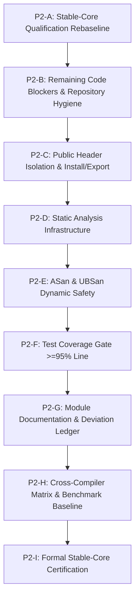

# AegisMathLib Stable-Core Qualification Rebaseline V1

> [!IMPORTANT]
> **Governance Authority**: [`docs/ENGINEERING_STANDARD_V1.md`](../ENGINEERING_STANDARD_V1.md)
> **Baseline Commit**: `b435cac09748fca4292f70f7b44830084d9feb8b`
> **Certification Status**: **NOT CERTIFIED** (Pending standalone header isolation, dynamic sanitizers, test coverage, and formal documentation)
> **Date**: 2026-09-15

---

## 1. Baseline Environment & Verification

- **Repository Baseline**: `b435cac09748fca4292f70f7b44830084d9feb8b`
- **Primary Compiler**: Apple Clang version 21.0.0 (`clang-2100.1.1.101`, target `x86_64-apple-darwin25.6.0`)
- **CMake Version**: 4.4.3
- **Test Suite Execution**:
  - **Debug** (`cmake-build-p2c-debug`): **108 / 108 PASS (100%), 0 warnings**
  - **Release** (`cmake-build-p2c-release`): **108 / 108 PASS (100%), 0 warnings**
- **Public Header Standalone Isolation Execution**:
  - **Debug** (`AegisMathLib_HeaderIsolation`): **68 / 68 TUs PASS (66 standalone + 2 order poisoning), 0 warnings**
  - **Release** (`AegisMathLib_HeaderIsolation`): **68 / 68 TUs PASS (66 standalone + 2 order poisoning), 0 warnings**
- **Compilation Flags**: `-std=c++20 -Wall -Wextra -Wpedantic -Wconversion -Wshadow -Werror`

---

## 2. Current Finding Ledger

Re-evaluated against [`docs/audits/AegisMathLib_Compliance_Audit_v1.md`](AegisMathLib_Compliance_Audit_v1.md):

| Finding ID | Domain / Subsystem | Original Severity | Current Status | Remediation Commit(s) | Current Verification Evidence |
| :--- | :--- | :---: | :---: | :--- | :--- |
| **AML-CRIT-001** | `Dynamics/EulerIntegrator` | **CRITICAL** | **REMEDIATED** | `8ecfc3c` | `tests/Dynamics/Regression/FreeFallTest.cpp` passes (1st-order convergence); frame transformation & attitude kinematics pass in `PropagationTest.cpp`. |
| **AML-CRIT-002** | `Geometry/Matrix3` | **CRITICAL** | **REMEDIATED** | `c5072ed` | `tests/Geometry/Matrix3Test.cpp` passes; adjoint cofactor matrix indices verified; in-place inversion aliasing eliminated; $A \times A^{-1} \approx I$. |
| **AML-CRIT-003** | `Core/MathFunctions` | **CRITICAL** | **REMEDIATED** | `b7cb4c3` | `tests/Core/MathFunctionsTest.cpp` passes; negative boundary domain clamping verified: $\arccos(-1.0001) = \pi$. |
| **AML-HIGH-001** | Architecture Layering | **HIGH** | **REMEDIATED** | `3c1646c` | `tests/Architecture/DependencyLayerTest.cpp` passes; strict one-way dependency chain verified: Core $\to$ Units $\to$ Geometry $\to$ Dynamics. |
| **AML-HIGH-002** | Template Instantiation | **HIGH** | **REMEDIATED** | `fed216e` | Public template instantiation test suites compile and pass for Core, Units, and Geometry. |
| **AML-HIGH-003** | `Dynamics/RigidBodyState` | **HIGH** | **REMEDIATED** | `3671816`, `5b6c938`, `761ee58`, `f086976`, `0b07a55`, `a17e77d`, `6038f7f` | Full inertia coupling solved via analytic 3x3 $LDL^T$ SPD solver without matrix inversion; `RigidBodyStateTest.cpp` (5/5) and `EulerDynamicsTest.cpp` (3/3) pass. |
| **AML-HIGH-004** | Dynamics Units & Lie Algebra | **HIGH** | **REMEDIATED** | `2418e94`, `a612ddf`, `cc95094`, `f322317`, `1cf9a86` | Model B 8-dimensional units system adopted; `RotationalCross` / `LieBracket` dimensional closure verified; raw untyped scalars eliminated from public API. |
| **AML-HIGH-005** | Geometry Frames & Comparisons | **HIGH** | **REMEDIATED** | `a98576d`, `532ff17`, `f40cec1`, `2c0f3a1`, `6c46413`, `129b29e`, `b435cac` | Generic `Matrix3<T>` intentionally remains unframed for pure linear algebra; frame tags enforced on geometric wrappers; `operator==` (exact component value), `AlmostEqual` (tolerances), and `RotationEquivalent` ($SO(3)$ double-cover) separated. |
| **AML-HIGH-006** | `Core/Result` Error Model | **HIGH** | **REMEDIATED** | `5f1c63b`, `31f67eb`, `2c584bb`, `59eb886` | Standard `std::variant`-backed `Result<T, MathError>` implemented; placement-new eliminated; constexpr support verified; monadic chaining passing. |
| **AML-MED-001** | Build Interface Pollution | **MEDIUM** | **REMEDIATED** | `1bb81c0` | Test sources removed from `AegisMathLib` INTERFACE library sources. |
| **AML-MED-002** | Deprecated Duplicated Unit System | **MEDIUM** | **REMEDIATED** | `d168798` | Deleted `include/AegisMath/Units/Unit.h`; removed from `CMakeLists.txt`; architecture guard test passes in `tests/Architecture/DependencyLayerTest.cpp`. |
| **AML-MED-003** | Flawed Inertia Positive Definiteness | **MEDIUM** | **REMEDIATED** | `5b6c938` | `InertiaTensor3::IsValid()` upgraded to 3-tier finite, symmetric, and $LDL^T$ positive pivot checks. Rejects indefinite matrices with positive diagonals. |
| **AML-MED-004** | Unbounded Iteration in `sqrt` | **MEDIUM** | **REMEDIATED** | `bc54c0e`, `fix(core)` | Bounded Newton iteration with `kMaxIterations = 64`; scalar types constrained to `float`/`double`; scale-aware IEEE-754 initial guess and convergence criterion; constexpr verified; `CoreSqrtTest` suite (8 tests) passes in `MathFunctionsTest.cpp`. |
| **AML-MED-005** | Quaternion Multiplication Order | **MEDIUM** | **DEVIATION** | — | Pipeline composition order $R_{AB} * R_{BC} \to R_{AC}$ harmonized across `RotationMatrix3` and `Quaternion`, documented in conventions; requires formal `AML-DEVIATION` registration. Blocker: **NO**. |
| **AML-MED-006** | Root Boilerplate & Maintenance Scripts | **MEDIUM** | **REMEDIATED** | `3d79ed2` | Deleted `library.h`, `library.cpp`, `fix_compile_errors.py`, and `update_units.py` via `git rm`. Zero build impact. |
| **AML-MED-007** | Missing Module Specification Docs | **MEDIUM** | **OPEN** | — | No `docs/core.md`, `docs/units.md`, `docs/geometry.md`, `docs/dynamics.md` exist under `docs/`. Blocker: **YES**. |
| **AML-MED-008** | Absence of `AML-DEVIATION` Tags | **MEDIUM** | **OPEN** | — | Zero formal `AML-DEVIATION` tags registered across the repository. Blocker: **YES**. |
| **AML-LOW-001** | Namespace Casing Inconsistency | **LOW** | **DEFERRED (ROADMAP)** | — | `AegisMath` vs `aegis::math`. Breaking change deferred to v2.0 or documented deviation. Blocker: **NO**. |
| **AML-LOW-002** | Member Variable Naming | **LOW** | **DEVIATION** | — | `x, y, z` public for standard-layout ABI. Documented in conventions; requires `AML-DEVIATION`. Blocker: **NO**. |
| **AML-LOW-003** | Function Casing Inconsistencies | **LOW** | **OPEN (STYLE DEBT)** | — | Mixed casing across legacy methods (`TryInverse` vs `transposed`). Non-blocking style debt. Blocker: **NO**. |
| **AML-LOW-004** | Weak Test Assertions | **LOW** | **OPEN (TEST HYGIENE)**| — | Isolated tests execute `SUCCEED();` without runtime verification after compile-time static asserts. Blocker: **NO**. |
| **AML-LOW-005** | Historical Non-Conventional Commits | **LOW** | **CLOSED** | — | Historical pre-governance commits preserved immutable. Current commit discipline is strictly conventional. Blocker: **NO**. |

### Summary Status
- **CRITICAL Findings**: 3 total | **3 REMEDIATED** | **0 OPEN**
- **HIGH Findings**: 6 total | **6 REMEDIATED** | **0 OPEN**
- **MEDIUM Findings**: 8 total | **5 REMEDIATED** | **2 OPEN** (MED-007, MED-008) | **1 DEVIATION** (MED-005)
- **LOW Findings**: 5 total | **1 CLOSED** | **2 OPEN (STYLE/TEST)** | **1 DEVIATION** (LOW-002) | **1 DEFERRED** (LOW-001)

---

## 3. Audit of Closed Findings for Regression Risk

| Finding ID | Description | Protected by Regression Test? | Protected by Compile-Time Contract? | Regression Risk |
| :--- | :--- | :---: | :---: | :---: |
| **AML-CRIT-001** | FreeFall truncation & Euler integration | **YES** (`FreeFallTest.cpp`, `PropagationTest.cpp`) | **YES** (Frame-typed integration states) | **LOW** |
| **AML-CRIT-002** | Matrix3::TryInverse index & aliasing | **YES** (`Matrix3Test.cpp`) | **NO** (Runtime numerical arithmetic) | **LOW** |
| **AML-CRIT-003** | MathFunctions::acos domain clamping | **YES** (`MathFunctionsTest.cpp`) | **NO** (Runtime boundary logic) | **LOW** |
| **AML-HIGH-001** | Architecture reverse dependency | **YES** (`DependencyLayerTest.cpp`) | **YES** (CMake library target boundary) | **LOW** |
| **AML-HIGH-002** | Uninstantiated dead template code | **YES** (3 public template test suites) | **YES** (Explicit template instantiations) | **LOW** |
| **AML-HIGH-003** | Rigid-body dynamics full inertia solve | **YES** (`RigidBodyStateTest.cpp`, `EulerDynamicsTest.cpp`) | **YES** (Frame & typed inertia tags) | **LOW** |
| **AML-HIGH-004** | Strong physical units & Lie bracket | **YES** (`DynamicsUnitsTest.cpp`, `UnitsSystemRevisionB2Test.cpp`) | **YES** (Compile-time 8D exponent tracking) | **LOW** |
| **AML-HIGH-005** | Geometry frame safety & comparisons | **YES** (`GeometryComparisonTest.cpp`: 13 tests) | **YES** (Static delete of cross-frame operators) | **LOW** |
| **AML-HIGH-006** | Result<T, MathError> safety | **YES** (`ResultTest.cpp`: 14 tests) | **YES** (`constexpr std::variant`, type traits) | **LOW** |
| **AML-MED-001** | Interface library source pollution | **YES** (`CMakeLists.txt`, `DependencyLayerTest.cpp`) | **YES** (Target build dependencies) | **LOW** |
| **AML-MED-002** | Duplicate legacy unit system | **YES** (`DependencyLayerTest.cpp`: `NoLegacyDuplicateUnitsSystem`) | **YES** (File deletion & single `Units` namespace) | **LOW** |
| **AML-MED-003** | Inertia positive definiteness check | **YES** (`InertiaTensorTest.cpp`: 7 tests) | **YES** (Concept guards on typed solver) | **LOW** |
| **AML-MED-004** | Core::Math::sqrt unbounded iteration | **YES** (`MathFunctionsTest.cpp`: 6 `CoreSqrtTest` tests) | **YES** (Hard `kMaxIterations = 64` cap) | **LOW** |
| **AML-MED-006** | Root boilerplate and maintenance scripts | **YES** (`git status`, clean working tree) | **YES** (Files deleted from repository) | **LOW** |

---

## 4. Stable-Core Qualification Blockers

Based on Sections 5, 48, 50, 85, 86, 88, 89, 90, 101, 104, and 124 of [`docs/ENGINEERING_STANDARD_V1.md`](../ENGINEERING_STANDARD_V1.md), an issue is classified as an authoritative **Stable-Core Blocker** if and only if it compromises mathematical correctness, safety bounds, modular self-containment, or mandatory qualification gates.

> [!NOTE]
> Tool unavailability on the local host (such as `clang-tidy` or `cppcheck` missing from PATH) is **NOT** a code finding; it represents an unfulfilled qualification gate whose status is recorded as `NOT RUN`.

### Authoritative Blocker Ledger
1. **AML-MED-007**: Missing formal module specification documents under `docs/` (violates Sections 87 & 88).
2. **AML-MED-008**: Absence of formal `AML-DEVIATION` tags registered for architectural deviations (violates Sections 101 & 102).
3. **AddressSanitizer (ASan)**: Dynamic memory safety verification not executed (Sections 88 & 124).
4. **UndefinedBehaviorSanitizer (UBSan)**: Dynamic undefined-behavior verification not executed (Sections 88 & 124).
5. **Test Coverage Gate**: Instrumentation and verification against coverage thresholds ($\ge 95\%$ line, $\ge 90\%$ branch, 100% function) not executed (Sections 86 & 124).
6. **Required Cross-Compiler Matrix**: Portability qualification across GCC, Clang, and MSVC not executed (Sections 2 & 89).
7. **Required Static Analysis Gates**: Clang-Tidy and Cppcheck static-analysis qualification not executed (Section 90).

---

## 5. Qualification Matrix

Status vocabulary is strictly standardized to: `PASS`, `FAIL`, `NOT RUN`, `PARTIAL`, `DEFERRED`, `NOT APPLICABLE`.

| Qualification Gate | Standard Reference | Status | Evidence / Notes | Blocker? | Remediation Phase |
| :--- | :--- | :---: | :--- | :---: | :---: |
| **Correctness Audit** | Sec 60–74, 80 | **PASS** | 108/108 tests pass; all CRITICAL/HIGH closed; no algorithmic regressions. | **NO** | — |
| **Numerical Reliability** | Sec 14–18, 48 | **PASS** | IEEE-754 enforced; Solve-Not-Invert adopted; condition bounds active. | **NO** | — |
| **Debug Build & Tests** | Sec 89, 90, 124 | **PASS** | `cmake-build-p2c-debug`: 108/108 tests pass, 0 warnings. | **NO** | — |
| **Zero Compiler Warnings** | Sec 3, 90 | **PASS** | `-Wall -Wextra -Wpedantic -Wconversion -Wshadow -Werror`: 0 warnings. | **NO** | — |
| **Bounded Numerical Loops** | Rule 7, Sec 48 | **PASS** | AML-MED-004: Core::Math::sqrt bounded to $kMaxIterations = 64$. | **NO** | Remediated (bc54c0e) |
| **Single Concept per File** | Sec 6 | **PASS** | AML-MED-002: Duplicate Units/Unit.h removed. | **NO** | Remediated (d168798) |
| **Repository Hygiene** | Sec 89, 92 | **PASS** | AML-MED-006: Boilerplate library.* and obsolete scripts removed. | **NO** | Remediated (3d79ed2) |
| **Public Header Isolation** | Sec 5, 89 | **PASS** | Standalone self-containment: PASS (66/66 public headers compiled in isolated TUs with zero warnings in Debug & Release). Unresolved transitive-include reliance: NONE OBSERVED. Aggregate order-poisoning TUs (2/2): PASS. | **NO** | Remediated (P2-C) |
| **Install / Export Validation** | Sec 89 | **NOT RUN** | FOLLOW-UP QUALIFICATION / PACKAGING DEBT. CMake package export is not an explicit DoD blocker in ENGINEERING_STANDARD_V1.md Sec 124. | **NO** | Packaging Debt |
| **Clang-Tidy** | Sec 90 | **NOT RUN** | Tool not installed locally; no `.clang-tidy` config file. | **YES** | **P2-D** |
| **Cppcheck** | Sec 90 | **NOT RUN** | Tool not installed locally; no `cppcheck` config file. | **YES** | **P2-D** |
| **AddressSanitizer (ASan)** | Sec 88, 124 | **NOT RUN** | No `-fsanitize=address` CMake configuration active. | **YES** | **P2-E** |
| **UndefinedBehaviorSanitizer (UBSan)** | Sec 88, 124 | **NOT RUN** | No `-fsanitize=undefined` CMake configuration active. | **YES** | **P2-E** |
| **ThreadSanitizer (TSan)** | Sec 88 | **NOT RUN** | Single-threaded kernels; periodic verification item; not an immediate P2 blocker. | **NO** | Periodic |
| **Test Coverage Gate** | Sec 86, 124 | **NOT RUN** | No coverage instrumentation or reports generated. | **YES** | **P2-F** |
| **Module Specification Docs** | Sec 87, 88 | **FAIL** | AML-MED-007: Zero `docs/<module>.md` documents exist. | **YES** | **P2-G** |
| **Formal Deviation Records** | Sec 101, 102 | **FAIL** | AML-MED-008: Zero `AML-DEVIATION` tags registered. | **YES** | **P2-G** |
| **Cross-Compiler Matrix: GCC** | Sec 2, 89 | **NOT RUN** | Local `/usr/bin/g++` is AppleClang wrapper; true GNU GCC not executed. | **YES** | **P2-H** |
| **Cross-Compiler: Upstream Clang** | Sec 2, 89 | **PARTIAL** | AppleClang 21.0.0 PASS; Linux upstream LLVM Clang not executed. | **YES** | **P2-H** |
| **Cross-Compiler: MSVC** | Sec 2, 89 | **NOT RUN** | Windows MSVC environment not available locally. | **YES** | **P2-H** |
| **No Fast-Math Enforced** | Sec 14, 89 | **PASS** | Zero `-ffast-math`, `/fp:fast`, or `-Ofast` flags configured. | **NO** | — |
| **Determinism Source Audit** | Rule 3, Sec 44 | **PASS** | No hidden RNG, wall clock, or mutable global nondeterministic sources in headers. | **NO** | — |
| **Explicit Allocation Audit** | Rule 5, Sec 29 | **PASS** | No explicit `new`/`delete`/`malloc`/dynamic containers in `include/AegisMath/`. | **NO** | — |
| **Zero Exceptions in Core Math** | Sec 36, 44 | **PASS** | Zero `throw`, `try`, `catch` in mathematical kernels. | **NO** | — |
| **Strict ISO C++20 Compliance** | Sec 2, 90 | **PASS** | Strict C++20 mode; zero C++23 features (`std::expected`, `std::print`). | **NO** | — |
| **Benchmark Baseline** | Rule 8, Sec 81 | **NOT RUN** | No formal benchmark runner configured or baseline recorded. | **NO** | **P2-H** |

---

## 6. Detailed Subsystem Audit Findings

### 6.1 Tool Availability
- `clang++`: `/usr/bin/clang++` (Apple clang version 21.0.0, `clang-2100.1.1.101`, Target: `x86_64-apple-darwin25.6.0`)
- `g++`: `/usr/bin/g++` (Apple clang symlink/wrapper, **NOT** real GNU GCC)
- `clang-tidy`: **Not found** on host system
- `cppcheck`: **Not found** on host system
- `llvm-cov`: **Not found** on host system
- `gcov`: `/usr/bin/gcov` (Present, wrapper around Apple LLVM coverage)
- `cmake`: `4.4.3` (Present)

### 6.2 Public Header Census & Isolation
- **Total Public Headers**: **66 files** under `include/AegisMath/`:
  - Core: 10 headers
  - Units: 30 headers (BaseUnits: 8, DerivedUnits: 10, Detail: 2, Root: 10)
  - Geometry: 15 headers (Detail: 2, Root: 13)
  - Dynamics: 11 headers (Detail: 2, Root: 9)
- **Template-Instantiation Evidence**: **8 headers/types** currently exercised by dedicated instantiation test suites.
- **Standalone Single-Header Translation-Unit Qualification**: **PASS (66 / 66 headers)**
  - Automated CMake qualification architecture implemented in `cmake/PublicHeaderIsolation.cmake`.
  - Qualification target `AegisMathLib_HeaderIsolation` (OBJECT library) generates and compiles 66 isolated translation units (one per public header) plus 2 include-order poisoning translation units (`order_poison_forward.cpp` and `order_poison_reverse.cpp`).
  - Strict compiler flags enforced: `-std=c++20 -Wall -Wextra -Wpedantic -Wconversion -Wshadow -Werror`.
  - Standalone self-containment: **PASS**.
  - Unresolved transitive-include reliance: **NONE OBSERVED**.
  - Initial Failure Count: 0 on single-header TUs; 1 duplicate symbol collision discovered via include-order poisoning (`include/AegisMath/Units/DerivedUnits/Frequency.h` previously duplicated `NewtonUnit` from `Force.h`, remediated to `HertzUnit`).
  - Fixed Header Count: 1 (`Frequency.h`).
  - Isolation Build Verification:
    - Debug: 68 / 68 TUs PASS, 0 warnings.
    - Release: 68 / 68 TUs PASS, 0 warnings.

### 6.3 Determinism & Reproducibility Audit
- **Hidden Nondeterminism Source Audit**: **PASS**
  - No hidden RNG (`rand`, `std::random_device`), wall-clock dependency (`std::chrono::system_clock`), or mutable global nondeterministic source was detected in Stable-Core production headers.
  - Algorithms follow pure functional state-in / state-out contracts.
- **Cross-Build / Cross-Compiler Reproducibility**: **NOT RUN**
  - Bitwise reproducibility across compilers, target architectures, or varying floating-point environments has not been benchmarked with reference checksums.

### 6.4 Memory Allocation Audit
- **Explicit Allocation / API Audit**: **PASS**
  - No explicit `new`, `delete`, `malloc`, `free`, or dynamic standard containers (`std::vector`, `std::string`, `std::map`) were detected in `include/AegisMath/`.
  - Stable kernel value types strictly use fixed-size storage and standard-layout value semantics.
- **Runtime Allocation Instrumentation**: **NOT RUN**
  - Zero-allocation execution paths have not yet been dynamically validated via operator-new interception or heap profilers under full workload stress.

### 6.5 Dynamic Sanitizers (ASan / UBSan / TSan)
- **AddressSanitizer (ASan)**: **NOT CONFIGURED**, **NOT RUN** (Blocker).
- **UndefinedBehaviorSanitizer (UBSan)**: **NOT CONFIGURED**, **NOT RUN** (Blocker).
- **ThreadSanitizer (TSan)**: **NOT CONFIGURED**, **NOT RUN**.
  - *Qualification Policy*: Current Stable-Core implementation is single-threaded and contains no internal threading primitives. TSan is therefore not an immediate P2 blocker unless the engineering standard requires it for the Stable certification gate, but it remains a periodic verification item rather than "not applicable".

### 6.6 Loop Bounds Audit
- **Bounded Iteration Audit**: **PASS**
  - Zero unbounded `while` loops exist in the production header tree.
  - `Core::Math::sqrt` employs bounded iteration with hard cap `kMaxIterations = 64` and scale-aware relative tolerance.

---

## 7. Recommended P2 Execution Roadmap

### Stage Scopes
1. **P2-B — Remaining Code Blockers & Repository Hygiene**:
   - Fix **AML-MED-004** (Remediated): Bounded iteration in `Core::Math::sqrt` with `kMaxIterations = 64`.
   - Fix **AML-MED-002** (Remediated): Removed deprecated redundant `include/AegisMath/Units/Unit.h`.
   - Fix **AML-MED-006** (Remediated): Removed boilerplate `library.*` and root maintenance scripts.
2. **P2-C — Public Header Isolation & Install/Export Validation**:
   - Implement single-header compilation test matrix for all 66 public headers.
   - Configure CMake install and export rules.
3. **P2-D — Static Analysis Infrastructure**:
   - Establish `.clang-tidy` and `cppcheck` configuration rules and CI definitions.
4. **P2-E — Dynamic Sanitizers (ASan / UBSan)**:
   - Configure `-fsanitize=address,undefined` in CMake; verify 100% clean test execution.
5. **P2-F — Test Coverage Gate**:
   - Instrument build with gcov/llvm-cov; verify 100% function, $\ge 95\%$ line, $\ge 90\%$ branch coverage.
6. **P2-G — Module Documentation & Deviation Ledger**:
   - Author formal documents: `docs/core.md`, `docs/units.md`, `docs/geometry.md`, `docs/dynamics.md` (**AML-MED-007**).
   - Register all formal `AML-DEVIATION` tags in codebase (**AML-MED-008**).
7. **P2-H — Cross-Compiler Matrix & Benchmark Baseline**:
   - Establish cross-compiler portability matrix (GCC, Clang, MSVC) and microbenchmark baseline.
8. **P2-I — Stable-Core Certification**:
   - Final audit check against Section 124 Definition of Done; formal sign-off.
