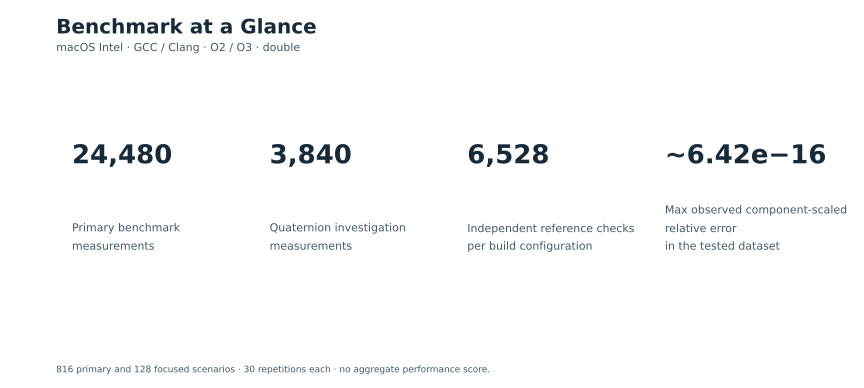
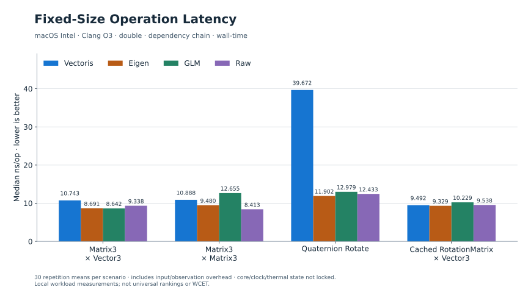
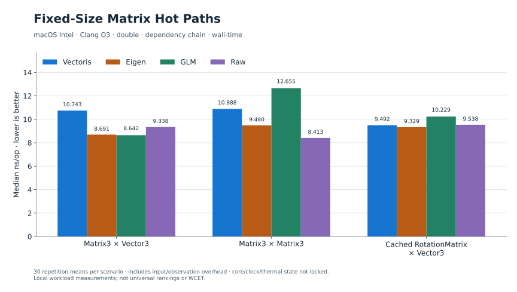
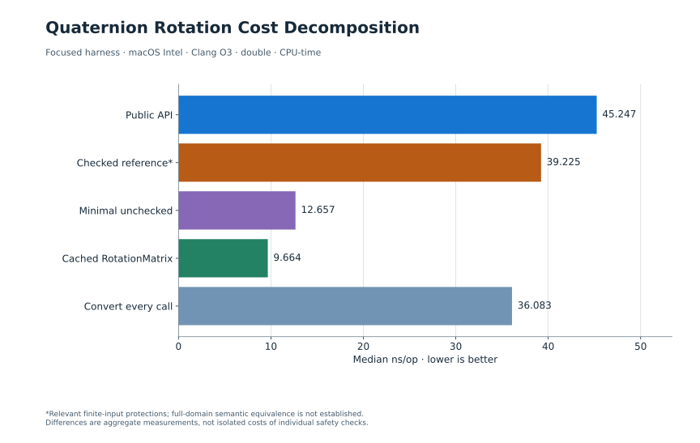
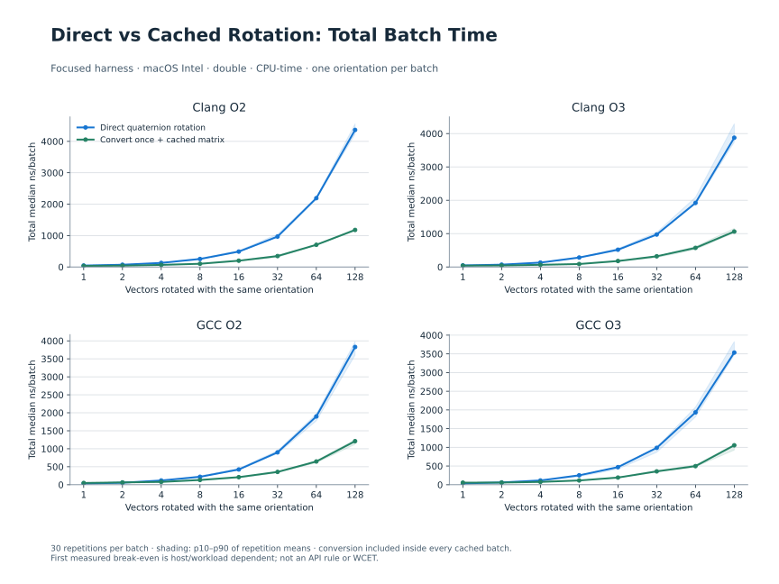
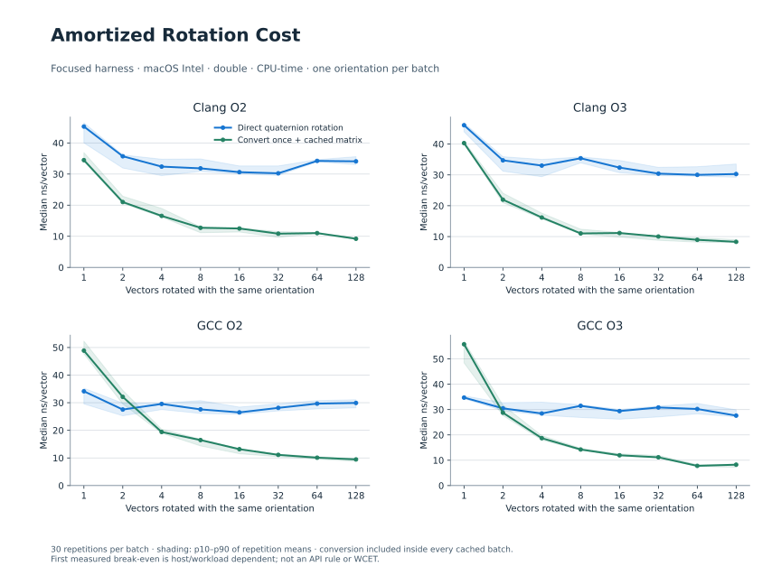
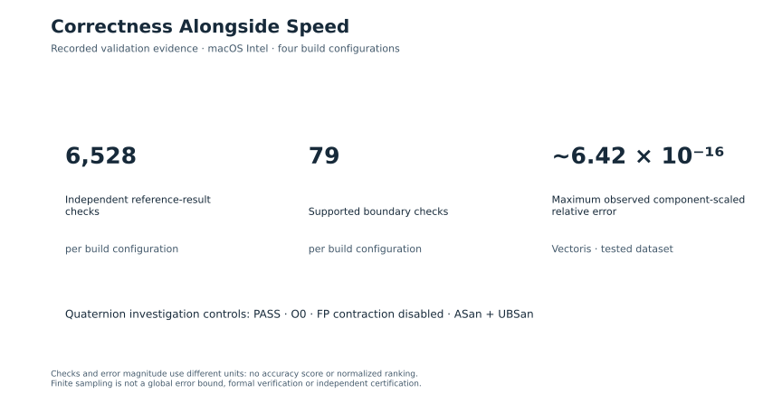
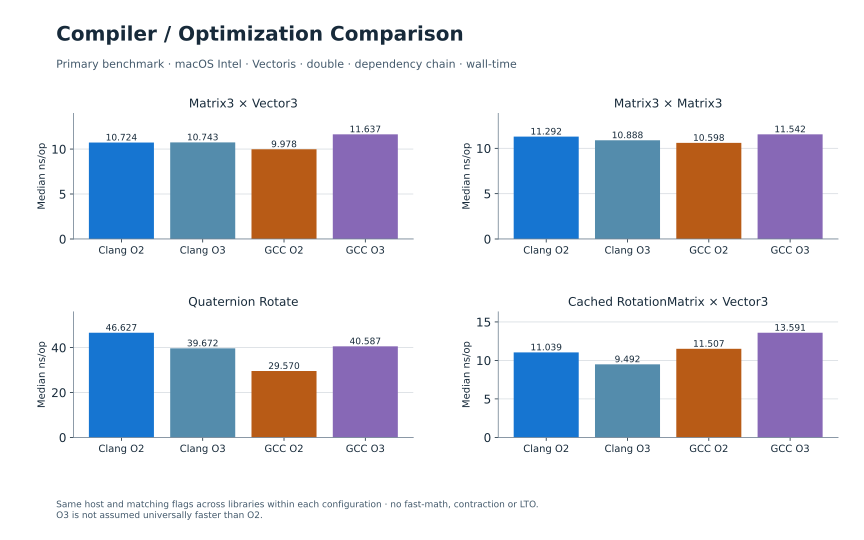
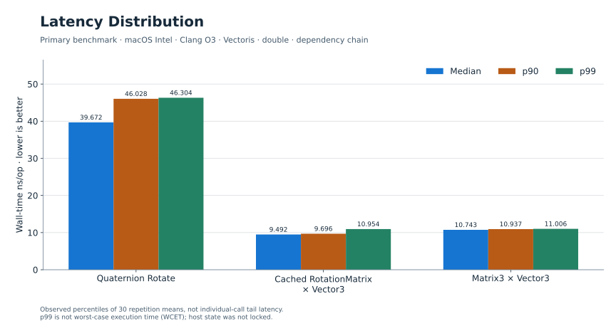

# VectorisNumerics 1.0 Performance

**Engineering math without surrendering performance.**

Fixed-size engineering mathematics with explicit numerical behavior and measured performance trade-offs.

VectorisNumerics targets small, fixed-size engineering mathematics where numerical behavior, explicit semantics and predictable data structures matter alongside raw speed. This publication shows where the measured matrix paths are competitive, and where direct quaternion rotation carries a substantial cost.

> **Measurement scope:** macOS Intel, GCC and Clang, O2 and O3, primarily `double`. Linux x86-64 was not measured in this publication. CPU core, clock frequency and thermal state were not locked. These measurements characterize workloads on the tested macOS Intel system. Percentile latency is not WCET.

Software baseline: **v1.0.0**, release SHA `be678b17a9ba58c9be5bca5ab59112fe74d9a83b`. Benchmarking does not alter the v1.0.0 qualification status or historical findings.

## Benchmark at a Glance

| Primary benchmark measurements | Quaternion investigation measurements | Independent reference checks / build configuration | Max observed component-scaled relative error |
| ---: | ---: | ---: | ---: |
| 24,480 | 3,840 | 6,528 | ~6.42 × 10⁻¹⁶ **in the tested dataset** |

The primary campaign covers 816 measurement scenarios; the focused investigation covers 128. Each scenario has 30 selected repetitions. Correctness counts are per build configuration, not totals across the four configurations.

## Fixed-Size Performance

**macOS Intel · Clang O3 · double · dependency-chain workload. Median wall-time ns/op; lower is better.**

| Operation | Vectoris | Eigen | GLM | Raw |
| --- | ---: | ---: | ---: | ---: |
| Matrix3 × Vector3 | 10.743 | 8.691 | 8.642 | 9.338 |
| Matrix3 × Matrix3 | 10.888 | 9.480 | 12.655 | 8.413 |
| Quaternion Rotate | 39.672 | 11.902 | 12.979 | 12.433 |
| Cached RotationMatrix × Vector3 | 9.492 | 9.329 | 10.229 | 9.538 |

Vectoris delivers competitive fixed-size matrix performance in the measured workloads. That includes results where it is slower: Matrix3 × Vector3 is above all three reference medians in this configuration. Matrix3 × Matrix3 falls between the measured Eigen and GLM medians, with Raw lower. These observations do not establish a universal library ranking.

Cached RotationMatrix × Vector3 closely tracks the Raw fixed-size baseline here: **9.492 vs 9.538 ns/op**. The difference is below 3%, so we describe these results as comparable. The full chart retains the much taller direct-rotation bar.

## Quaternion Rotation: A Deliberate Trade-off

The most interesting result was not a win. The original publication workload measured direct Vectoris rotation at **39.672 ns/op**, compared with **11.902 Eigen**, **12.979 GLM** and **12.433 Raw**. These paths agree within the timed input domain, but their extreme-input protections differ.

Separate original-workload retests produced **39.889** and **40.102 ns/op** using CPU-time. The focused investigation produced **45.247 ns/op** for the public path. The original publication value is wall-time; focused and retest values are CPU-time. They remain separately identified, and none replaces another.

**Focused harness · Clang O3 · double · median CPU-time ns/op.** Public API: 45.247; checked reference: 39.225; minimal unchecked kernel: 12.657; cached RotationMatrix: 9.664; convert every call and rotate: 36.083.

> The checked reference preserves relevant finite-input protections but has not been proven semantically identical to the production implementation over the full domain. Differences must not be interpreted as isolated costs of individual safety checks.

The focused investigation produced a higher public-path median than the original publication workload. The public kernel instruction sequence was consistent, but the timing difference has not been independently isolated. Both datasets are preserved.

### What the direct path does

**Source-level behavior, built-in double path:** no per-call factory normalization and no per-call sqrt. It does apply squared-norm correction, nine coefficient divisions, coefficient clamping, overflow-aware accumulation and boundary handling. A unit quaternion and finite vector are preconditions; direct rotation is not a general invalid-input validation factory.

**Compiler-specific observations:** the inspected Clang executable used an out-of-line call, temporaries/register pressure and stack traffic. These are code-generation observations, not a portable instruction-count or cycle guarantee.

The results demonstrate a substantial cost associated with the protected direct-rotation path. The measured difference cannot be attributed to one individual safety mechanism. This publication adopts **Recommendation B**: disclose the cost and explain the existing cached-matrix alternative.

## Repeated Rotation Guidance

> If you rotate vectors repeatedly using the same orientation, benchmark the cached RotationMatrix path. On the tested system, its conversion cost can amortize very quickly. This is workload guidance, not an API rule to always convert.

The cached batch includes one checked quaternion-to-matrix conversion followed by N matrix rotations. Total times come from measured batch records; per-vector times divide those batch medians by N. They are not estimates from isolated headline latencies.

| Configuration | First tested median win | First tested p10–p90 separation |
| --- | ---: | ---: |
| Clang O2 | 1 vector(s) | 1 vector(s) |
| Clang O3 | 1 vector(s) | 1 vector(s) |
| Gcc O2 | 4 vector(s) | 4 vector(s) |
| Gcc O3 | 2 vector(s) | 4 vector(s) |

“First tested” means among N = 1, 2, 4, 8, 16, 32, 64 and 128. GCC O3 first wins on the median at two vectors; descriptive distribution separation is clear at four. The p10–p90 criterion is not a formal confidence claim or universal break-even threshold.

## Correctness Alongside Speed

Per build configuration, the primary suite recorded **6,528 independent reference-result checks** and **79 supported boundary checks**, all passing. The maximum observed Vectoris component-scaled relative error across the tested dataset was approximately **6.42 × 10⁻¹⁶**. This is a sampled maximum, not a global library error bound.

Long-double reference calculations and analytic 180° rotation cases complement ordinary inputs. The focused investigation also recorded correctness controls passing under **O0**, **FP contraction disabled**, and **ASan + UBSan**. These are recorded controls, not a new independent audit in this publication.

The comparison tolerance scales component error by the reference payload's maximum component, with a floor. It can therefore mask a large relative error in a component close to zero; [input/output examples](evidence/primary/input-output-examples.csv) and the full accuracy evidence remain available.

## Compiler / Optimization Results

These four representative operations use the primary benchmark's wall-time data. Compiler and optimization settings materially change some results; O3 is not assumed universally faster than O2. The focused quaternion CPU-time results remain separate.

The percentiles describe **30 repetition averages**, not individual calls. p99 is an observed percentile, not worst-case execution time.

## Methodology

- Intel Core i9-9980HK, 8 physical / 16 logical cores, 32 GiB RAM, macOS 26.7. Apple Clang 21.0.0 and Homebrew GCC 16.2.0.
- C++20 Release-oriented O2/O3 builds; `-DNDEBUG -march=x86-64 -fno-fast-math -ffp-contract=off -fno-lto`. Matching settings across libraries within each configuration. Eigen 5.0.1, GLM 1.0.1, Google Benchmark 1.9.1.
- 64 runtime inputs span scales approximately 1e-9, 1 and 1e12; fixed seed `0x564543544F524953`. Timed loops load inputs and observe results, preventing a compile-time constant-only benchmark.
- Primary dependency-chain and eight-lane throughput modes are distinct. Headline figures select dependency-chain latency. These figures include harness overhead and are not isolated instruction latencies.
- Warm-up and aggregate/control records are separate from the 30 selected repetitions. A documented Core dependency control replaces 720 original abs/AlmostEqual records; it does not add a second 30-repetition set to those scenarios.
- Native JSON → selected raw CSV → independently recalculated statistics → derived CSV → generated SVG. All 28,320 selected records were checked against native JSON for this publication.

## Limitations

Linux x86-64 and MSVC performance were not measured. This dataset does not cover every public API, scalar type, hardware target or engineering magnitude independently. Runtime qualification on other platforms is distinct from these local performance measurements.

Core affinity, frequency and thermal state were not locked; desktop background work was not fully isolated. Small differences are descriptive and are reported as comparable when below 3%. Within-process repetitions are not established independent trials. No universal fastest-library, zero-overhead, WCET or external certification claim follows.

The v1.0.0 release explicitly accepted two deferred qualification-tooling findings, **AFA5-001 and AFA5-002**. Candidate #15's targeted independent re-audit remained **FAIL** under the original zero-MAJOR policy. Neither this benchmark nor publication closes that debt. See [evidence and release context](methodology-and-evidence.md).

## Reproducibility

Read the [full performance report](evidence/primary/VectorisNumerics_1.0.0_Performance_Report.md) and [Quaternion investigation report](evidence/focused/VectorisNumerics_1.0.0_Quaternion_Rotation_Performance_Investigation.md), [environment manifests](methodology-and-evidence.md#environment-and-method), and [input/output examples](evidence/primary/input-output-examples.csv). For chart reproduction, follow [package instructions](methodology-and-evidence.md#offline-reproduction). Full benchmark reconstruction uses the original bundle instructions and a new output directory; do not overwrite these datasets.

Links below point to this published documentation tree. Full archive availability and privacy exclusions are recorded in the methodology; no unhosted archive is presented as a downloadable asset.

## Raw Evidence

- [Primary benchmark evidence ZIP](methodology-and-evidence.md#complete-archive-availability)
- [Quaternion investigation evidence ZIP](methodology-and-evidence.md#complete-archive-availability)
- [Selected primary raw CSV](evidence/primary/raw.csv) / [selected focused raw CSV](evidence/focused/raw.csv)
- [Derived data and provenance](data/provenance.json) / [independent cross-check](data/verification.json)
- [Claim audit](claim-audit.md) / [deep dive](deep-dive.md)

Benchmark results are workload-, compiler-, hardware-, and configuration-dependent and should not be interpreted as universal performance rankings.

Performance benchmarks do not substitute for numerical correctness or robustness validation.

Percentile latency is not WCET.
