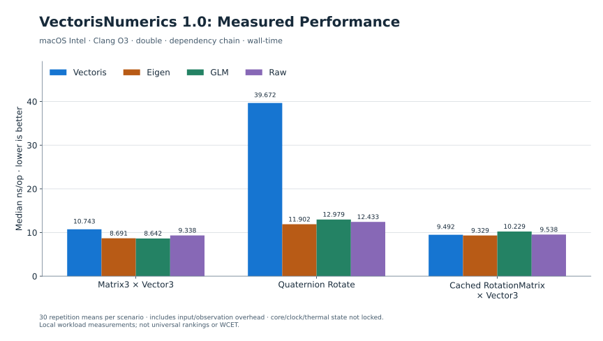

# Performance announcement drafts

These are copy-ready drafts, not posted announcements. Links are relative to this publication package and must be updated if placed elsewhere. Software baseline: v1.0.0, `be678b17a9ba58c9be5bca5ab59112fe74d9a83b`. Benchmarking does not alter qualification status or historical findings.

## Short

VectorisNumerics 1.0: engineering math without surrendering performance. Across 24,480 primary measurements on macOS Intel, fixed-size matrix paths were competitive, cached rotation approached Raw, and direct quaternion rotation exposed a measurable numerical-protection trade-off. Local results, no universal winner claim. [Results and limits](README.md).

## Medium

We benchmarked VectorisNumerics 1.0 with GCC and Clang at O2/O3 on macOS Intel: 24,480 primary measurements, plus 3,840 focused quaternion measurements.

The Clang O3 double dependency-chain workload put cached RotationMatrix × Vector3 at 9.492 ns/op, comparable to Raw's 9.538. Direct quaternion rotation was a different story: 39.672 ns/op in the original workload, with measurable cost associated with stronger numerical handling. We kept that result visible and investigated it separately.

Independent reference-result and boundary checks accompanied timing. Core, clock and thermal state were not locked; Linux was not measured, and percentile latency is not WCET. [Full publication](README.md).

## Technical

VectorisNumerics 1.0 performance data is now packaged for technical review: 816 primary scenarios × 30 repetitions, plus a separate 128-scenario quaternion investigation. The baseline is the unmodified v1.0.0 release; primary figures use wall-time, focused figures CPU-time.

Under Clang O3 / double / dependency chain, Matrix3 × Matrix3 measured 10.888 ns/op for Vectoris, compared with Eigen 9.480, GLM 12.655 and Raw 8.413. Cached RotationMatrix × Vector3 was comparable to Raw: 9.492 vs 9.538. Direct quaternion rotation measured 39.672 ns/op, while the focused public-path median was 45.247. These are separate harness results, both preserved.

The protected direct path performs norm-squared coefficient correction, nine coefficient divisions, clamping and overflow-aware accumulation; it does not call factory normalization or sqrt per rotation. The checked-reference comparison does not establish full-domain equivalence or isolate individual safety costs. Actual batch measurements show rapid cached-matrix amortization on this system.

Per build configuration, 6,528 independent reference-result checks and 79 supported boundary checks passed. The approximately 6.42e-16 maximum scaled relative error is an observed dataset result. Core/frequency/thermal state were not locked; Linux performance is unmeasured; percentiles are repetition averages, not WCET. The release's AFA5-001/002 qualification-tooling debt remains accepted and deferred. [Methodology, limitations and raw evidence](README.md).

