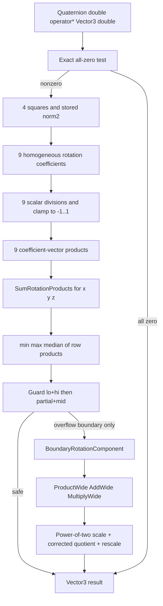
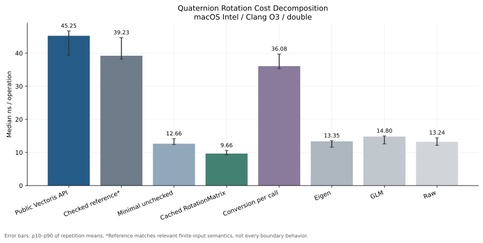
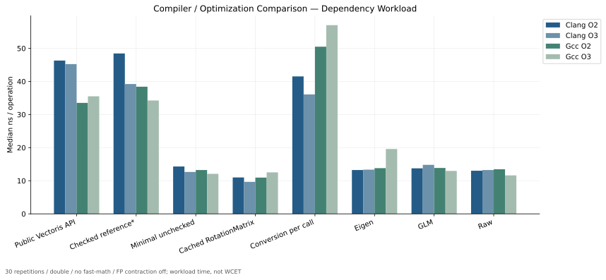
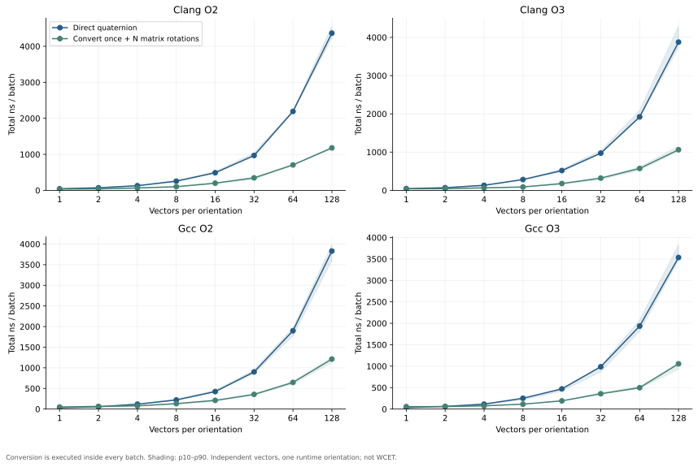
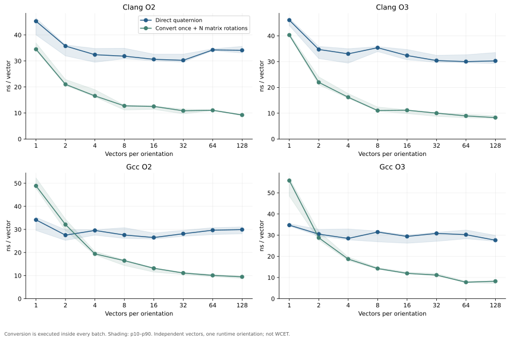
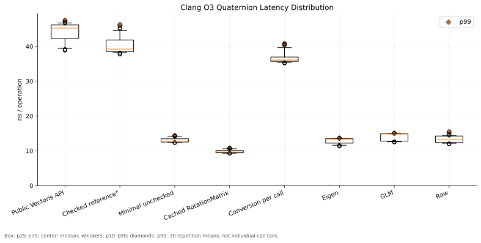

# VectorisNumerics 1.0.0 Quaternion Rotation Performance Investigation #1

**主计时日期：2026-10-03，Asia/Singapore。性质：READ-ONLY PERFORMANCE INVESTIGATION。**
完成验证的 UTC 时间记录于 `preservation.json`，补充 controls 和主计时分开保存。

生产发布 SHA：`be678b17a9ba58c9be5bca5ab59112fe74d9a83b`；tag：`v1.0.0`。
这不是 remediation、Candidate #16、独立审计、重新资格认证或 1.0.1 实施授权。

## Executive Summary

1. 原始 publication workload 的 **39.672 ns 已大体复现**：第一次复测 **39.889 ns**，后续原可执行文件单独筛选复测 **40.102 ns**。原数据未删除、未覆盖。
2. 当前 double public rotation **不在每次调用时执行工厂归一化或 sqrt**；但重新计算平方范数，用它校正全部 9 个旋转系数，并钳位系数、排序求和、检查即将溢出的加法。只有溢出边界走二分量补偿和精确二次幂缩放。
3. focused harness 的 Clang O3：Public **45.247 ns**，Checked reference **39.225 ns**，Minimal **12.657 ns**，Cached matrix **9.664 ns**，Conversion-per-call **36.083 ns**。这些均为 30 次重复的 CPU ns/operation 中位数。
4. 安全参考保留相关保护后，耗时接近 Public，证明“普通未检查公式约 12–13 ns”不是可直接替换的语义等价实现。**不能将差值全部算作 validation、封装或归一化开销。**
5. Clang O3 的 Public 内核没有完全内联，并有栈溢出暂存；GCC O3 在真实 benchmark 回调中内联了常规路径。这是可调查的实现/代码生成机会，不是已证实的编译器 bug。
6. 转换一次再旋转 N 个向量的实际中位数首次胜出：Clang O2/O3 **N=1**，GCC O2 **N=4**，GCC O3 **N=2**；GCC O3 的 p10–p90 区间到 **N=4** 才完全分开。均包括真实转换和检查成本，不是单次数据相除。
7. **公共宣传建议选择 B**：直接四元数旋转带有实测的数值保护/语义成本；缓存矩阵路径具有接近原始固定尺寸矩阵运算的表现。没有证据支持“直接旋转全面性能领先”。

## Baseline

- Fresh detached worktree：`[local detached worktree path omitted]`。
- HEAD：`be678b17a9ba58c9be5bca5ab59112fe74d9a83b`。
- Tree SHA：`cb7598c0b13a06385d97118e7bb52fd30cb26beb`。
- Exact tag：`v1.0.0`；tracked worktree clean。
- main 保持 `0c9971244b830c6edf31fc3cefe6cf90ae6c6989`，没有改动、reset、rebase 或强制同步。
- 所有新增源码/编译目录先位于 `/tmp/vectoris-quaternion-perf-investigation`；最终证据复制到本报告目录，均在 Git tree 外。
- 工程依据：冻结 `docs/ENGINEERING_STANDARD_V1.md` 的 Quaternion/rotation convention、§114–118 可复现 benchmark / 优化配置 / FP 合同，以及 `docs/geometry.md` §6 和数值边界补充。
- 没有修改生产代码、测试、文档、CI、发布分支、tag、GitHub Release、VRT/AFA 状态。

## Reproduction

| 测量 | Clang O3 Public median ns | 说明 |
| --- | --- | --- |
| Original publication | 39.672 | 历史固定数据 |
| Original executable / all four quaternion variants | 39.889 | 当前机器、相同 flags/input/30 repetitions |
| Original executable / Public only | 40.102 | 后续同条件单独筛选 |
| Focused investigation / full campaign | 45.247 | 本报告成本分解的共同 harness |
| Focused executable / Public only | 45.752 | 后续单独筛选 |

focused 与 original 单独筛选中位数差约 14.09%。已检查真实可执行文件：两者 Public 内核都是 **368 条静态指令**、144-byte stack subtraction、1 `divsd` + 4 `divpd`；去掉指令地址/RIP 常数位移后，寄存器和算术指令序列 **完全一致**。回调完整静态指令数是 original 137、focused 117，但其中包含计时循环外的 counter 设置，不能据此预测热循环耗时。

没有频率锁定、硬核心绑定或硬件性能计数器证据；共享桌面、代码布局、缓存/分支环境或频率变化均没有分别隔离。**差异原因 NOT INDEPENDENTLY ISOLATED。** 原始结果可复现，不存在“39.7 ns 差异并不存在”的前提错误；但不得将新 focused 数字替换原历史数字。成本差值只在 focused 同一 harness 内计算。

## API Semantics

实际头文件：[`Quaternion.h`](https://github.com/steven1n/Vectoris/blob/v1.0.0/modules/VectorisNumerics/include/Vectoris/Numerics/Geometry/Quaternion.h#L205)。命名空间 `vectoris::numerics::Geometry`；公开 canonical alias `vectoris::numerics::geometry`。

```cpp
template <ScalarArithmetic U>
constexpr auto operator*(const Vector3<U, FrameFrom>& v) const
    noexcept(std::is_arithmetic_v<T> && std::is_arithmetic_v<U>);
```

返回 `Vector3<decltype(T{} * U{}), FrameTo>`；FrameFrom 匹配在编译期检查，错误 Frame overload 被删除。class 内定义在语言层面隐式 inline，**这不保证编译器实际内联**。本次 T=U=double：constexpr-capable、noexcept=true。

相关 API：

```cpp
static constexpr Core::Result<Quaternion>
TryCreate(T w, T x, T y, T z) noexcept(std::is_arithmetic_v<T>);

[[nodiscard]] constexpr Core::Result<RotationMatrix3<T, FrameFrom, FrameTo>>
ToRotationMatrix() const noexcept(std::is_arithmetic_v<T>);
```

- 工厂：finite 验证、最大绝对分量缩放、sqrt、归一化、符号规范化；**setup 阶段执行，不计入每次 direct rotation**。
- double direct rotation：valid-unit quaternion + finite vector 前置条件。没有错误 Result，也没有每次输入 finite/norm validity 检查；不支持把已被任意写坏的公开四元数字段视为安全输入。
- 平方范数校正是 **coefficient roundoff correction**，不是调用 TryCreate 对象归一化；没有 sqrt。
- `ToRotationMatrix`：检查四元数 finite/分量范围；形成矩阵；`RotationMatrix3::TryCreate` 检查矩阵 finite、determinant 和 orthogonality。成功并不静默归一化，失败必须检查 Result。
- 四元数 4 个字段 public mutable，构造期归一化不是 lifetime invariant；仓库没有另一个强制不可变的 `UnitQuaternion` 类型。不能默默假定原先的验证/缓存始终有效。
- All-zero vector 保留输入 zero signs；其他 signed zero 遵循该算术路径。确实不可表示的最终结果允许 Inf，没有有限饱和 sentinel。
- 保护边界使用 compensated two-component arithmetic，不依赖 MSVC long double 更宽、FMA 或 contraction。
- 本次只调查内置 double；泛型 Quantity/custom scalar 的其他适配路径没有计时或作新资格判断。

## Call Graph



`SumRotationProducts` / `RotationSumNeedsWide` 在常规 Public body 内；`BoundaryRotationComponent` 在 Clang O3 是 out-of-line cold helper。没有 Quaternion Hamilton multiply、conjugate、cross、matrix conversion 或 Result 构造进入 direct double hot path。source `else` 的两次叉乘是其他 scalar category 路径，**不是这次 double 路径**。

转换路径：`q.ToRotationMatrix → finite/range checks → Matrix3 coefficients → RotationMatrix3::TryCreate → finite + CheckRotationInvariants(det, transpose×matrix, Frobenius) → Result`，然后 `RotationMatrix3::operator* → ApplyRow`。缓存 case 在 setup 转换一次；batch/Conversion-per-call 则在计时区内转换。

## Static Work Estimate

以下是未计 CSE/SIMD 前的源码表达式统计，**不是 CPU 指令/周期模型**。

| 项 | 一次非零普通 double rotation |
| --- | --- |
| FP multiplies | 31：4 squares + 18 off-diagonal expression multiplies + 9 vector products |
| FP add/sub | 24 core coefficient/product additions; plus 6 max-bound subtractions = 30 |
| division | 9 coefficient divisions |
| sqrt | 0 |
| abs | 0 |
| isfinite | 0 direct-input validations |
| comparison expressions | 约 57：3 zero + 18 coefficient clamp + 24 min/max/median + 12 guard/sign choices |
| source control | zero shortcut + 3 row decisions + 2 guarded sums/row; ternary/comparison reductions may compile to masks/cmov |
| Quaternion constructions | 0 in direct rotate |
| Vector3 constructions | result initialization/return; trivial copies eligible for elimination |
| normalizations | 0 factory/sqrt normalization; one stored norm2 correction |
| scaling | 0 ordinary path; power-of-two down/up only on boundary fallback |

SSE vectorization与 CSE 会改变实际 multiply/add 数量；例如乘 2 可能被编译为加法。边界 fallback 另有有界 compensation 工作，不包含在此 ordinary estimate 中。

## Benchmark Methodology

- CPU：Intel Core i9-9980HK @ 2.40GHz，8 physical / 16 logical cores，32GiB RAM。
- OS：macOS 26.7 / build 25G229 / x86_64。
- Clang：Apple clang 21.0.0 (`clang-2100.1.1.101`)；GCC：Homebrew 16.2.0；CMake 4.4.3。
- Google Benchmark 1.9.1、Eigen 5.0.1、GLM 1.0.1，重用上一轮冻结依赖快照，没有下载漂移的新版本。
- 四配置：Clang O2/O3、GCC O2/O3。共同 flags：`-std=c++20 -DNDEBUG -march=x86-64 -fno-fast-math -ffp-contract=off -fno-lto`，strict warnings 保持 `-Wall -Wextra -Wpedantic -Wconversion -Wshadow -Werror`。
- 探针通过 CMake `Vectoris::Numerics` interface，BUILD_TESTING=OFF。原始 compile_commands.json 保存，assembly flags 来自实际 compilation database；没有猜 include/define。
- 原64组 input 生成过程原样复制，包括相同随机数消费顺序/数据结构，seed `0x564543544F524953`，runtime setup，scale 1e-9 / 1 / 1e12；不是 constant-expression input。
- latency/dependency workload：当前结果第一分量 sign bit 决定下一次 input identity，连同递增 step；所有 variant 在64组输入上 sign-selector 相同（448 对照/config）。这是 **result-dependent workload envelope**，包括 loads、next-index 和 output observation，不是 isolated instruction latency。
- throughput：单线程8个独立 operand lanes；每iteration时间除8得到 ns/vector。不是8线程。
- batch：每iteration使用同一 runtime orientation，处理 N=1,2,4,8,16,32,64,128 个独立向量；convert-once 在iteration内执行，结果全部 materialized/observed，不允许只用首分量而删掉其他结果；首结果决定下一组索引。
- `DoNotOptimize` 保留输出；throughput/batch `ClobberMemory`；没有 random_device。
- 每case 30 repetitions；warmup 0.01s；每 repetition minimum CPU time 0.04s。最终128场景、3840条 primary records；各case实际累积 CPU 测量至少 **1.103s**。
- 所有编译和正确性完成后，四配置顺序计时，不并发运行 compiler/benchmark。后续 profiler/remarks 单独运行且全部排除 primary timing。
- 原 campaign 顺序与本次不同；本次固定注册顺序并保留，未按结果筛选 repetitions、未取 best run。
- raw 时间戳为真实 run start/end，**不是不存在的单次 repetition timestamp**。Google Benchmark不提供每 repetition 精确 wall-clock timestamp；每条记录显式标记 `timestamp_scope`。

### Variants / fairness

| variant | 实现 | 计时内工作/差异 |
| --- | --- | --- |
| V1 Public | 发布 q*v | 完整 direct double kernel |
| V2 Checked_reference | 独立 homogeneous coefficients + norm correction + clamp + opposite-sign-first guarded sum | 同有限域相关保护；边界用 macOS long double，不复制生产 compensation；pq/pv snapshot adapter 的复制成本包含在测量中 |
| V3 Minimal | 独立 two-cross formula | 无norm correction、clamp、sum guards；valid-unit/common magnitude前置条件 |
| V4 Cached_matrix | 发布 q.ToRotationMatrix + r*v | 转换只在setup；r*v保护仍保留 |
| V5 Conversion_per_call | 发布 q.ToRotationMatrix().Value()*v | 每次实际转换、Result检查、rotation |
| Eigen | native eq*ea | assumes normalized, unguarded two-cross |
| GLM | native gq*ga | assumes normalized, unguarded two-cross |
| Raw | plain two-cross | 与原始 adapter 相同，无额外保护 |

V2 **不是对全域和每个位模式完全等价的 production substitute**：输入 valid-unit/finite 为前置条件，无额外伪造的 factory validation；不同 coefficient evaluation/grouping；取消配对策略不同；long-double boundary fallback 不能保证 MSVC 等价且没有覆盖所有 overflow-rounding情形。V2 的跨 Frame snapshot 被显式计时，未单独隔离适配成本。它只能表征“相关有限输入保护的另一实现”，不能拿其时间定义一个 universal safety tax。

V3/Eigen/GLM/Raw 在共同 timing域通过 correctness，但明确不提供 public极端finite guarantee；没有对错误结果做性能宣传。极端max反例未计时未检查variants。没有声称四个库failure semantics或zero-sign契约一致。

## Correctness Before Timing

每个四配置：**884/884 PASS**；额外 same-orientation/different-vector 全64×64 pair control：**12,288/12,288 PASS/config**（Public、Cached、Checked三条路径）。O0和ASan+UBSan也884/884 PASS。

- 512 publication input/variant比较；336 common boundary比较；36 protected axis-boundary比较。
- identity、90°（q=(1,1,0,0)工厂归一化）、180°X/Y/Z、non-axis (1,2,3,4)，small/ordinary/1e3/1e6/7e6/1e12/1e150/max/16。
- 额外强语义cases：max finite、mixed max、subnormal、signed all-zero，Public/Checked/Cached。
- Independent oracle：long-double homogeneous quaternion-to-matrix formula × vector / norm²，不调用被测 rotate；单位四元数axis反例另用解析符号翻转。
- General relative component-scale tolerance 2e-13；保护case的all-zero/denormal general tolerance有floor，因此另外提供 **69/69 analytic bit-pattern checks**，四配置+O0+ASan+UBSan均PASS，验证180°对denorm_min、min normal、max/2、max和工程量级的非零分量不被丢掉，并检查direct all-zero signs。不是只做isfinite。
- Clang O3已测样本最大 component-scale relative error：**5.322e-16**；不是全域 worst-case proof。
- sanitizer control flags：`ASAN_OPTIONS=halt_on_error=1:abort_on_error=1`、`UBSAN_OPTIONS=halt_on_error=1:print_stacktrace=1`。只检验本次 probes，不冒称重跑完整qualification。
- timing入口运行validate及selector checks，失败即nonzero；错误 variant 不进入计时。

## Cost Decomposition

| variant | median ns/op | mean | stddev | p10 | p90 | p95 | p99 | min | max |
| --- | --- | --- | --- | --- | --- | --- | --- | --- | --- |
| Public | 45.247 | 44.132 | 2.870 | 39.392 | 46.715 | 46.809 | 47.317 | 38.862 | 47.496 |
| Checked_reference | 39.225 | 40.380 | 2.527 | 38.236 | 44.680 | 45.187 | 46.001 | 37.740 | 46.285 |
| Minimal | 12.657 | 13.017 | 0.658 | 12.410 | 14.148 | 14.185 | 14.312 | 12.319 | 14.361 |
| Cached_matrix | 9.664 | 9.812 | 0.452 | 9.318 | 10.600 | 10.621 | 10.726 | 9.254 | 10.768 |
| Conversion_per_call | 36.083 | 36.772 | 1.730 | 35.347 | 39.733 | 40.515 | 40.756 | 35.167 | 40.791 |
| Eigen | 13.349 | 12.889 | 0.803 | 11.592 | 13.542 | 13.593 | 13.624 | 11.339 | 13.625 |
| GLM | 14.799 | 14.092 | 1.049 | 12.595 | 14.992 | 15.015 | 15.042 | 12.500 | 15.052 |
| Raw | 13.245 | 13.355 | 1.008 | 12.149 | 14.420 | 14.562 | 15.276 | 11.982 | 15.527 |



**Aggregate differentials，不能解释成某一个 helper 的独立成本：**

- Public − Checked reference：**6.022 ns**。
- Checked reference − Minimal：**26.569 ns**。
- Public − Cached matrix：**35.583 ns**。
- Conversion-per-call − Cached：**26.419 ns**，包含转换/校验/Result/布局差异，不是纯转换函数计时。
- Minimal 相对Public：**3.57×** 更低工作负载耗时（约 72.0% 降低）；不是合规替代实现。

## Compiler Comparison

| variant | Clang O2 | Clang O3 | GCC O2 | GCC O3 |
| --- | --- | --- | --- | --- |
| Public | 46.312 | 45.247 | 33.528 | 35.523 |
| Checked_reference | 48.459 | 39.225 | 38.420 | 34.246 |
| Minimal | 14.303 | 12.657 | 13.239 | 12.091 |
| Cached_matrix | 10.989 | 9.664 | 10.952 | 12.528 |
| Conversion_per_call | 41.518 | 36.083 | 50.508 | 57.008 |
| Eigen | 13.240 | 13.349 | 13.808 | 19.592 |
| GLM | 13.750 | 14.799 | 13.868 | 12.977 |
| Raw | 13.031 | 13.245 | 13.469 | 11.622 |



全部是 ns/op median；不能跨编译器数字直接定义单项指令成本。GCC O2 public比GCC O3低，**O3不是无条件更快**；GCC O3 Eigen wrapper 的out-of-line决定与真实 benchmark 不同，所以不能靠独立 wrapper 判断所有context。

### Throughput: eight independent lanes

| variant | Clang O2 ns/vector | Clang O3 ns/vector | GCC O2 ns/vector | GCC O3 ns/vector |
| --- | --- | --- | --- | --- |
| Public | 36.130 | 32.928 | 24.316 | 27.657 |
| Checked_reference | 44.626 | 45.488 | 26.221 | 27.642 |
| Minimal | 6.335 | 6.008 | 7.535 | 4.656 |
| Cached_matrix | 11.106 | 9.963 | 10.858 | 10.574 |
| Conversion_per_call | 45.297 | 34.484 | 57.802 | 46.704 |
| Eigen | 5.900 | 4.889 | 4.868 | 3.865 |
| GLM | 5.988 | 4.864 | 3.635 | 4.590 |
| Raw | 5.516 | 5.542 | 7.424 | 4.925 |

不要和上面的dependent workload混列：每iteration八个独立输出、一次共同barrier。转换percall对每个lane实际发生。

## Assembly Analysis

完整assembly、object/executable disassembly以及真实回调都保存到 `assembly/`。Clang以Intel syntax输出；Homebrew GCC Darwin配置拒绝 `-masm=intel`，因此GCC `.s` 使用native AT&T，再用llvm-objdump输出Intel disassembly。保留原工具错误，不改compiler/toolchain。

**静态指令site统计，包括该body的cold paths；不含被调函数除非单独列出。** load/store为显式memory-operand site，含常量读取；不计CPU µops、cache misses或动态执行数量。`sub rsp` 不等于完整frame（push/red-zone另计）。

| compiler / body | instructions | FP mul | FP add/sub | div sites | sqrt | branches | calls | loads | stores | stack memory sites | stack sub bytes |
| --- | --- | --- | --- | --- | --- | --- | --- | --- | --- | --- | --- |
| clang-O3 / _public_rotate | 17 | 0 | 0 | 0 | 0 | 0 | 1 | 2 | 2 | 2 | 24 |
| clang-O3 / public out-of-line body | 368 | 11 | 34 | 5 | 0 | 17 | 3 | 79 | 18 | 36 | 144 |
| clang-O3 / _checked_rotate | 17 | 0 | 0 | 0 | 0 | 0 | 1 | 2 | 2 | 2 | 24 |
| clang-O3 / checked reference helper | 427 | 32 | 65 | 8 | 0 | 25 | 0 | 74 | 29 | 56 | 112 |
| clang-O3 / _minimal_rotate | 45 | 12 | 12 | 0 | 0 | 0 | 0 | 10 | 2 | 0 | 0 |
| clang-O3 / _cached_rotate | 43 | 0 | 0 | 0 | 0 | 0 | 3 | 20 | 5 | 4 | 24 |
| clang-O3 / _eigen_rotate | 46 | 9 | 10 | 0 | 0 | 0 | 0 | 14 | 2 | 0 | 0 |
| clang-O3 / _glm_rotate | 45 | 12 | 11 | 0 | 0 | 0 | 0 | 10 | 2 | 0 | 0 |
| clang-O3 / cold compensated helper | 428 | 52 | 182 | 2 | 0 | 0 | 0 | 73 | 7 | 14 | 0 |
| clang-O3 / rotation row helper | 201 | 20 | 52 | 0 | 0 | 8 | 0 | 22 | 0 | 0 | 0 |
| gcc-O3 / _checked_rotate | 454 | 52 | 74 | 6 | 0 | 38 | 0 | 65 | 51 | 71 | 0 |
| gcc-O3 / _minimal_rotate | 52 | 15 | 15 | 0 | 0 | 0 | 0 | 7 | 3 | 0 | 0 |
| gcc-O3 / _cached_rotate | 902 | 87 | 191 | 0 | 0 | 126 | 0 | 132 | 23 | 69 | 0 |
| gcc-O3 / _glm_rotate | 49 | 12 | 11 | 0 | 0 | 0 | 0 | 12 | 2 | 0 | 0 |
| gcc-O3 / cold compensated helper | 519 | 76 | 241 | 2 | 0 | 0 | 0 | 42 | 13 | 36 | 0 |
| gcc-O3 / _public_rotate | 412 | 19 | 40 | 9 | 0 | 49 | 3 | 53 | 29 | 58 | 136 |
| gcc-O3 / Eigen out-of-line helper | 55 | 14 | 12 | 0 | 0 | 0 | 0 | 12 | 4 | 3 | 0 |
| gcc-O3 / _eigen_rotate | 15 | 0 | 0 | 0 | 0 | 0 | 1 | 2 | 2 | 2 | 32 |

Clang Public wrapper17指令+called publicbody368（cold compensated helper另428）；Minimal整个wrapper45指令。**不能拿17对45说Public更简单**，也不能拿368/45当cycles比。GCC Public wrapper412（cold helper另519）、Minimal52；Cached wrapper902含展开的安全fallback，绝大部分不在普通输出上运行，因此大静态代码并不意味着它比Public慢。

## Inlining Analysis

实际optimized benchmark callback证据（不是只看noinline assembly wrapper）：

- Clang O3 Public：每operation调用 `Quaternion<double,Frame,Frame>::operator*<double>`；内部SumRotationProducts/minmax/guards内联。正常输入没有cold `BoundaryRotationComponent`调用。
- Clang O3 Cached：三次 `RotationMatrix3::ApplyRow<double>` 调用；普通shortcut仍快速。
- Clang O3 Checked：调用独立reference helper；Minimal/Eigen/GLM/Raw常规算术内联。
- Clang O3 Conversion-per-call：回调调用 `eval<4>`，其中实际conversion/validation发生。
- GCC O3真实回调：Public/Cached/Minimal/Eigen/GLM/Raw普通路径内联；Checked helper仍out-of-line。独立 noinline `eigen_rotate` wrapper另调用 `_transformVector`，这是context差异，不代表计时回调一定如此。
- 没有经源码或者assembly证明的“Quaternion temporary multiplication/conjugation”热点；也没有每次调用sqrt。

## Instruction / Branch / Stack / SIMD Analysis

1. Clang的9个double coefficients编译成 **1 scalar divsd + 4 packed divpd**（仍是9 lane divisions）；GCC Public wrapper是9 divsd。无sqrt。
2. Scalar SSE与packed SSE都有；portable `-march=x86-64` 控制下，没有AVX/FMA site。Clang/GLM/Eigen/Raw最小公式都有packed算术，Vectoris也有，所以“Vectoris没SIMD”不是根因。
3. Clang Public body有144-byte explicitstackallocation以及可见Spill/Reload注释；除boundary保存还有普通coeff/product暂存。回调中return Vector3到stack，再观察array有输出store/reload。Minimal noinline wrapper没有stackmemory site（仅push frame pointer），与Public有实质差别。
4. Cached对象在setup/batch转换期存在，普通row kernel无需Quaternion对象；Result属于转换路径，不属于direct。Frame标签没有runtime字段/比较，不能凭这些输出store反推Frame抽象是主因。
5. 诊断remarks：Clang对rotation reductions能做SLP，也有不划算/不可vectorize决策；GCC有16-byte loop/SLP successes及control-flow misses。完整remarks保存，没有调整正式timingflags去追最佳结果。
6. 这些迹象支持“代码形状、division依赖、registerpressure、outline决定值得优化实验”，**没有证明compilermiscompile或可免除的确定ns成本**。

## Profiling

macOS `/usr/bin/sample` 可用。单独启动8s public workload并以1ms间隔采样5s；sampling期间所有timing数字排除正式统计。采样主线程3625次：Public operator 3032（约83.6%），bench callback593（约16.4%）。它确认热点位于rotationbody及其调用/输出工作，没有捕获sqrt、TryCreate归一化或boundaryhelper热点。

Sampling stack比例不是精准时间归因、不是cycles、不是WCET；初始化/采样启动时机和函数inline会影响归属。`llvm-mca` 未安装；没有使用频率锁定、PMU counters或cycles模型。

## Numerical-Safety Cost / Attribution

| 分类 | 证据 | 结论强度 |
| --- | --- | --- |
| validation | direct没有finite/norm合法性拒绝；conversion有finite/range/det/orthogonality | direct validation cost不是39.7ns解释 |
| normalization | direct无sqrt/TryCreate；存储norm²及9coef除法存在 | norm correction存在；factory normalization不存在 |
| numerical protection | clamp、ordered sums、overflow guards、cold compensation | 普通path已经支付guard/order成本；boundary scale没有在普通dataset执行 |
| API abstraction | frames仅compile-time；Vec returned/observed stack；reference另有pq/pvadapter | 没有独立隔离frame/wrapper成本 |
| compiler codegen | Clang out-of-line、spills；GCC普通内联；SSEboth | 真实证据；不是compiler bug证明 |
| implementation inefficiency | 每vector重新算q coefficients；大body影响inline；可复用matrix | 可摊销且有实验机会；avoidable gain未单独证明 |

主要解释是 **不同数值语义所需的工作 + 当前实现/代码生成的执行方式**。未检查formula能少掉9coefdivisions/order/guards，但会重新引入历史finite→Inf反例。Public与Checked相近只是aggregate证据；无法给出可信“安全成本占X%、implementation占Y%”分账。

## Direct vs Cached Rotation





Clang O3批次数据，**total includes one checkedconversion**：

| N | Direct total ns | Convert_once total ns | Direct ns/vector | Convert_once ns/vector |
| --- | --- | --- | --- | --- |
| 1 | 46.091 | 40.301 | 46.091 | 40.301 |
| 2 | 69.417 | 43.929 | 34.708 | 21.965 |
| 4 | 132.048 | 64.736 | 33.012 | 16.184 |
| 8 | 283.109 | 88.175 | 35.389 | 11.022 |
| 16 | 517.644 | 178.463 | 32.353 | 11.154 |
| 32 | 972.928 | 320.736 | 30.404 | 10.023 |
| 64 | 1920.269 | 572.729 | 30.004 | 8.949 |
| 128 | 3875.579 | 1061.972 | 30.278 | 8.297 |

重复direct允许compiler自行复用可见同一q的工作，没有人为禁止合法优化；没有因此保证它已经hoist全部coeff。转换方式则在source显式表达reuse。128向量时重复64组数据，不是128组全新随机样本，但每个输出都实际计算和observed。

## Break-Even Analysis

| 配置 | first tested median win N | first tested p10/p90 separation N |
| --- | --- | --- |
| Clang O2 | 1 | 1 |
| Clang O3 | 1 | 1 |
| Gcc O2 | 4 | 4 |
| Gcc O3 | 2 | 4 |

只表示测试网格中的首次胜出，未插值推测N=3、未保证所有机器或orientation的阈值。p10/p90分开是描述性稳健检查，不是正式置信检验。

Clang O3在 N=1 就可能更快：conversion虽然有更多校验，但其普通矩阵vector path不需要每vector的norm²校正/完整minmax路径，compiler布局也不同。这是实测结果，不是“转换一定昂贵”的假设；GCC则N=1转换明显更慢。

矩阵转换使用存储homogeneous系数并校验，没有direct的norm²除法。两条路径可能有微小rounding差异，不能宣称全域bit-identical，尤其不能未经边界证明用cached结果替换任意directcontract。业务可采用既有Matrix API，并检查conversionResult及其合同；这是已有合法使用模式，不是新增unsafe fast path。

## Competitor Semantic Differences

| 语义 | Vectoris direct double | Eigen 5.0.1 | GLM 1.0.1 | Raw |
| --- | --- | --- | --- | --- |
| factory normalization per rotation | NO | NO | NO | NO |
| stored norm² correction | YES | NO | NO | NO |
| reject invalid unit quaternion each call | NO; caller precondition | NO; assumes unit | NO; assumes unit | NO; assumes unit |
| explicit finite input validation | NO direct; YES checked conversion | NO | NO | NO |
| bounded coefficients + protected sums | YES | NO | NO | NO |
| power-of-two compensated scaling | boundary only | NO | NO | NO |
| Frame type semantics | compile-time | not this adapter | not this adapter | NO |
| all-zero signs preserved explicitly | YES | no identicalpromiseinadapter | no identicalpromiseinadapter | no identicalpromiseinadapter |
| two-cross unchecked arithmetic | not built-in double path | YES | YES | YES |

Eigen `_transformVector`在冻结源码明确说明unit-quaternionrotation与先转matrix的work model；其nativebody就是cross、double、add。GLM `type_quat.inl`也是cross/cross，两者不验证/归一化输入，没有溢出保护。Raw与原adapter一致。

**原Quaternion Rotate chart分类：B. Partially equivalent comparison。** 共同有效输入上数学orientation相同，但极端有限域、rounding修正、zero signs和防溢出合同不同；不是A语义完全等价。Minimal是C算术基线，不能把它的快直接归为符合Vectoriscontract的实现。

独立 runtime-input 语义对照（Clang O3/GCC O3、FP contraction off）：`q=(0,1,0,0)`，`v=(0,DBL_MAX,0)`，Public/Checked/Cached 都得到 `(0,-DBL_MAX,0)`；Minimal 和 Eigen 得到 `(NaN,-Inf,NaN)`，GLM得到 `(0,-Inf,0)`。该输入违反未检查公式的中间值可表示范围；**没有计时这些错误结果，也没有将其作为竞争库违反Vectoris专属合同的finding**。它实际证实为何不能删保护换取minimal数字。证据：`logs/*-semantic-gap-run.log`。

当前原始harness的cachedVectoris matrix复测 **9.441 ns**，Raw rotation-matrix-vector复测 **9.470 ns**，ratio **0.997×**。这为“cachedmatrix near-raw”提供同结构实测支持，不把Raw quaternion值误当matrix值。

## Latency Distribution



表和图中的p90/p95/p99是 **30个repetition平均工作负载耗时**的样本分位数，不是每一次rotation调用的tail distribution。p99在30样本下尤其不稳定，不能当WCET、hard-real-time bound或p99 individualcall SLA。

## Optimization Opportunities — NOT IMPLEMENTED

| 优先级 | 机会 | 风险/前提 |
| --- | --- | --- |
| P0 (existing usage) | 在重复orientation工作负载使用现有checkedToRotationMatrix并摊销 | 已测gain；保留其公开合同、Result检查、rounding边界；不是改production |
| P1 | 探索更小ordinaryhotpath、把冷路径布局隔离，降低Clanginline/registerpressure | 只是plausible；必须保留overflow guards、norm correction、subnormal/cancellation、signedzero和nonfinite合同 |
| P1 | 探索明确provenbound下的ordinarysum路径，保留原boundaryfallback | 不能擅自照抄/删guard；需独立oracle、O0/O2/O3、contractionoff和GCC/Clang/MSVC validation |
| P2 | 明确批量旋转/预计算orientation的API设计 | architecture/sourcecompatibility工作；本次不新增 |
| P2 | 研究独立系数求值/vectorizationcodegen | 跨compiler验证；不把assemblyinstructions当cycles |
| REJECT | 删norm² correction/clamp/order/overflow保护，直接用two-cross当生产替代 | 会弱化历史finite result保障 |
| REJECT | 用fast-math/FMA/FPcontraction依赖隐藏错误 | 违反当前FPcontract或让correctness依赖配置 |
| REJECT | 隐式缓存publicmutablequaternion字段 | cacheinvalidity/lifetimecontract不成立 |
| REJECT | 把除法机械改成reciprocal或强制always_inline并声称安全 | rounding/overflow或code-size结果未验证，不能凭偏好实施 |

没有一个productionoptimization已被证明有“低风险+确定大gain”；P0只是现有API使用方式。P1建议作为 **另行授权的1.0.1候选性能实验**，先证明完整数值合同再测量，不建议直接承诺1.0.1提速倍数，也不建议因此阻塞/改写已发布1.0.0。

## Required Decision Output

| 问题 | 答案 |
| --- | --- |
| Q1 ~39.7 reproduced? | YES; original 39.889 / 40.102ns; focused separately 45.247ns |
| Q2 minimal faster? | 12.657ns, 3.57× lower than focusedPublic; unsupportedextremecontract |
| Q3 equivalent checked reference cost? | 39.225ns relevant-semanticsreference; fullboundary/bitwiseequivalence NOT ESTABLISHED; adapterincluded |
| Q4 normalization eachcall? | NO factory/sqrt normalization; YES storednorm²coefficientcorrection |
| Q5 sqrt/division? | sqrt0; 9lanedivisions ordinary; boundaryfallbackadditionalquotients |
| Q6 overflow-safe scaling? | YES boundaryonly; ordinary has coefficientclamp/order/guards butnoscaling |
| Q7 unexpected calls? | Clangpublicout-of-linecall; helperscoldcallsites; nohot sqrt/factory/Hamiltoncalls |
| Q8 spills/temporaries? | YES Clang144-bytebodyframe, coeffspills andreturnVector3 observation; noQuaternionmultiplytemporarychain |
| Q9 obviouscompilercodegenbug? | NO provedbug; outlining/registerpressure/vectorizationopportunities visible |
| Q10 semantics orimplementation? | both; relevantsemanticprotections are substantial, splitnotindependentlyisolated |
| Q11 cachedbreak-even? | ClangO2/O3testedN1; GCCO2N4; GCCO3medianN2/intervalseparationN4; actualconversionincluded |
| Q12 preservationoptimization plausible? | YESP1experiments; notprovedsafe/sizedgain |
| Q13 authorize1.0.1optimization? | Recommend separate boundedprototypeauthorization, not release or implementation now |

## Limitations

- Local macOS Intel only；Linux/MSVC/ARM、其他FP环境、nativearchitecture flags、float均NOT RUN。
- No core/frequencylock；没有校准温度读数；共享desktop background不能完全控制。ns是workloadmeasurement，不是cycleexactlatency/WCET。
- V2不复制全部MSVCportableboundarycompensation，不能作为release-ready替代。
- 共同dataset只有64组/3scales；边界正确性和batchpaircontrol扩充正确性证据，不是全域证明。
- 30repetitionquantiles是均值分布；不评估个别调用最大尾延迟。
- Preparation命令/exit记录保留（部分迭代日志路径被后续成功调用复用，不能当成原始失败stdout；诊断文本标记为tool-observed reconstruction，只有analytic初始native错误log另行完整保留）：GCCDarwin不支持`-masm=intel`；初始batchcontrol漏链接GBheaderstaticstream依赖；初始analyticprobe同一auto声明混合Vector3/array。均为外部tool/probe准备问题，已在Git外修正并重新运行。不是Vectorisproductionfailure；最终构建/控制均成功，没通过suppression绕过。
- 没有更新旧benchmark、资格门禁、版本、release、findingclosures或publicclaims。

## Raw Evidence

- `summary.csv/json`：128场景，包含median/mean/stddev/p10/p90/p95/p99/min/max。
- `raw.csv/json`：3840primaryrepetitionrecords，compiler/version、optimization、variant、workload、N、latency、iterations、run时间窗、exactVectorisSHA。
- `raw/<config>/timing.json`：GoogleBenchmark原始JSON；相应correctnessJSONL包含actual/reference结果。
- `reproduction/`：原四库Quaternionfiltered复测；`controls/`：原Public/focusedPublic/cached/Rawmatrix分别单独筛选的独立数据，不混入primary30reps。
- `reproduction/inputs.jsonl`：原64组runtimeinput，包括实际quaternion/vector及matrices；`source/dataset.h`复用同生成过程。
- `source/`：externalC++、CMake；`build-provenance.json`、`extra-evidence-provenance.json`、`timing-provenance.json`、`final-control-provenance.json`、`analytic-control-provenance.json`：命令、exit、logs/时间/源码SHA。
- `compile_commands/<config>.json`：实际compiler命令。
- `assembly/clang-o3-{public,minimal,checked,cached}.s`、`gcc-o3-{public,minimal,checked,cached}.s`及完整helpers/disassembly；所有standaloneprobe是noinlinewrapper，production未改。
- `assembly/instruction-summary.csv/json`、真实benchmarkfunction片段、原/新kernelcodegenequivalence、remarks。
- `profiling/public-sample.txt`：独立samplingrun，仅diagnostic。
- `environment.json` / `analysis-checks.json` / `preservation.json` / manifest：硬件工具、统计、SHA/clean-tree与内容完整性。
- `release-source-snapshot.tar`：从exactreleasecommit导出的publicheaders和相关standards/sourceCMake，只包含explicittracked范围，无privateignored材料。
- Dependency完整快照在前轮benchmarkevidencepackage，版本/hash引用保存在`prior-benchmark-reference.json`；不是重新获取unstable依赖。

## Recommended Next Action

如需要改善directrotation，单独授权 **semantics-preserving hot-path prototype investigation for1.0.1**：预先固定误差/finite/subnormal/cancellation/zero/frame合同，先原型正确性，再同结构测量，最后独立review及crosscompilerqualification。当前不创建branch、不修改源码、不发布1.0.1。

## Current Public Claim Recommendation

**B. Direct quaternion rotation carries measurable safety / semantic overhead, while cached matrix rotation reaches near-raw fixed-size performance.**

限定为本机、本工作负载、内置double和所测编译配置；directrotation不是semanticallyequivalentuncheckedcomparison。不得宣传“所有旋转快于Eigen/GLM”“typewrapperzerooverhead已全域证明”或“constanttime/WCETverified”。

## Final Status

```text
QUATERNION ROTATION PERFORMANCE INVESTIGATION #1:
COMPLETE
PRODUCTION CODE:
UNCHANGED
VECTORIS v1.0.0:
UNCHANGED
MAIN:
UNCHANGED
TAG:
UNCHANGED
PERFORMANCE FINDING:
Measured norm-corrected bounded coefficient evaluation and protected row sums
account for substantial additional work; Clang outlining and stack traffic
are also visible. Individual cost attribution is not independently isolated.
OPTIMIZATION:
NOT YET AUTHORIZED
```
