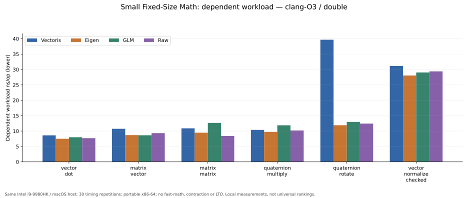
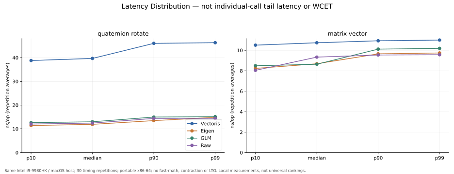
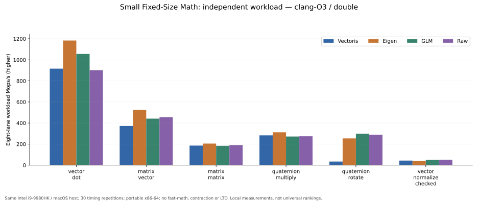
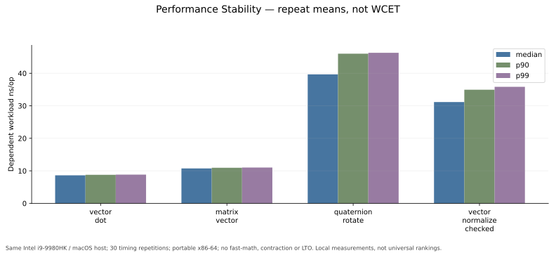
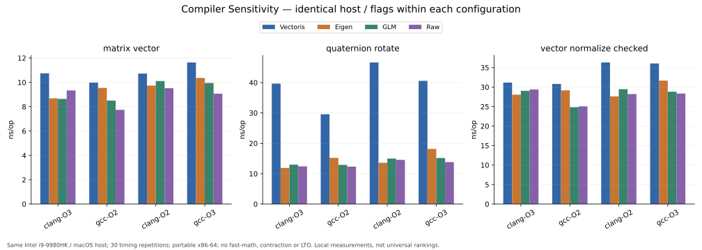
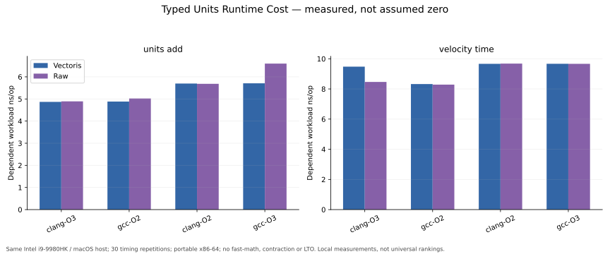
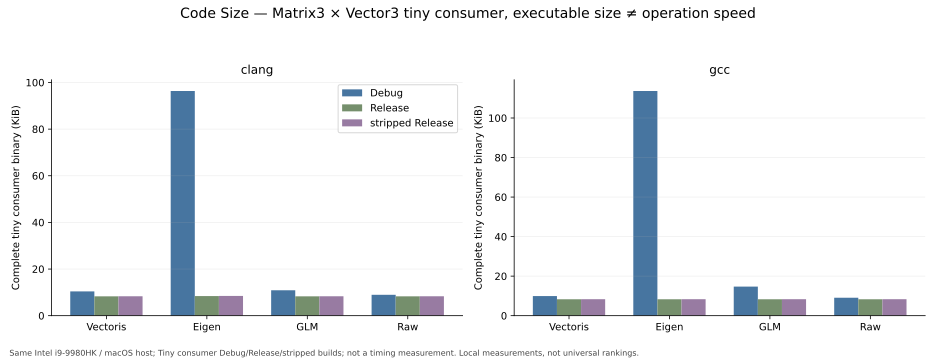
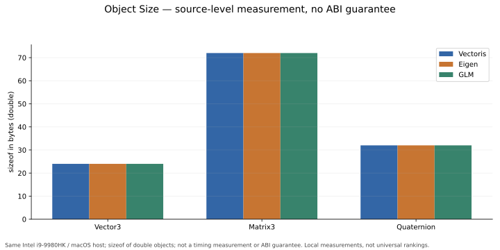
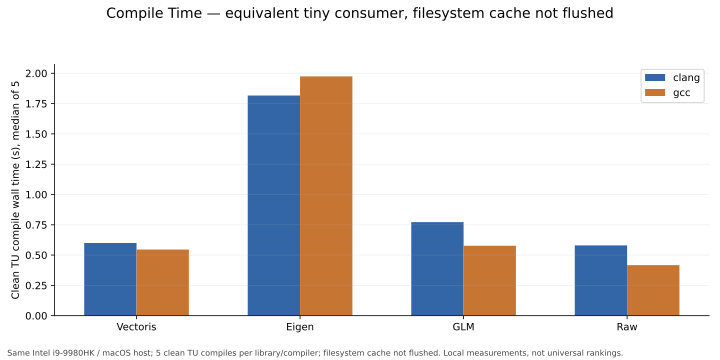
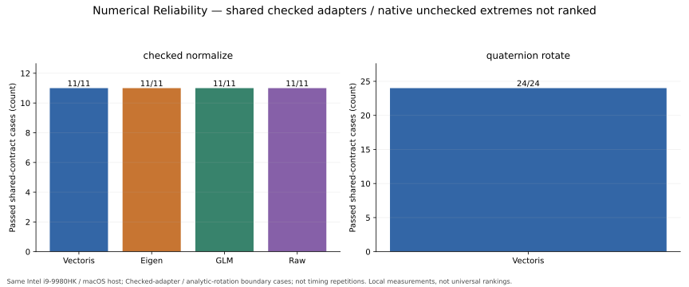

# VectorisNumerics 1.0.0 Performance Report

## Executive Summary / 结论

本报告实测已发布的 `v1.0.0`，生产 SHA `be678b17a9ba58c9be5bca5ab59112fe74d9a83b`。范围是当前 Intel macOS 机器的 GCC 16.2.0 与 AppleClang 21.0.0，分别使用 O2/O3；**Linux x86-64、MSVC、Apple Silicon、float 与 native 架构配置未执行**。这是本地性能特征记录，不是跨平台性能资格认证。

额外采集720条Core依赖链记录，替换原720条对应场景的计时；所有原始JSON保留，最终统计仍每场景30条，不将两批混算为60条。

共 28 个操作类别、102 个实际支持的操作/库组合、两种工作负载模式、4 个编译配置：**816 个汇总场景、24,480 条原始重复计时**。每场景 30 次重复；最短累计 CPU 测量 1.112 秒。全部数据和源码一并提供，没有综合评分。

正确性先于计时：每个配置 6,528/6,528 个独立 long-double 参考输出检查通过；支持合同内的 79 项边界检查通过。额外 Debug O0、ASan+UBSan 控制也通过。它们是本报告范围的样本证据，不证明所有输入/公开模板均正确。

**读数含义**：latency 是带结果依赖的工作负载耗时，包含取输入、输出观测与索引更新；throughput 是八路独立工作负载吞吐。两者均不是孤立 CPU 指令代价。对比仅限本次相同输入与有效输入合同。

Vectoris Quaternion rotation 在四配置下为 29.570–46.627 ns/op，具体结果见下文。安全处理所需的额外工作会真实体现在结果中；不省略不利于 Vectoris 的数据。未运行历史 C7 的同一套 harness，因此不把本轮值宣称为相对 C7 的准确回退倍数。

Benchmark results are workload-, compiler-, hardware-, and configuration-dependent and should not be interpreted as universal performance rankings.

Performance benchmarks do not substitute for numerical correctness or robustness validation.

## Methodology / 方法

- 所有库用同一编译器、C++20、O2 或 O3、`-DNDEBUG -march=x86-64 -fno-fast-math -ffp-contract=off -fno-lto`。未启用 fast-math、浮点重排、native 或 LTO。竞争库没有被关闭 SIMD 来帮助 Vectoris 获胜。
- 计时使用 Google Benchmark 1.9.1。每个场景预热 0.01 秒；每重复至少目标 0.04 秒，30 次重复的实际累计测量再检查 ≥1 秒。库对象在计时前构建；结果由 `DoNotOptimize` 观测，吞吐路径另用 `ClobberMemory`。
- latency：一般操作的下一组输入索引依赖上次输出的符号位；abs/AlmostEqual改用指数位52，因为它们的符号位是常量，会被优化器消去。后两项从补充原始采集替换，旧记录不删，两个harness的差异只有索引选择位。独立预检查确认同一操作/输入的各库选取位一致，因此相同迭代数下访问顺序一致。低位舍入不会改变路径。该结果依赖仅用于保留串行数据依赖，并不模拟任意真实应用状态演化。
- throughput：单线程，每次迭代执行八个独立输入（不是八个线程），报告 ns/op 时除以 8，Mops/s = 1000 ÷ ns/op。它不是硬件理论最大吞吐。
- 操作/库/模式注册顺序固定 seed 打乱，四配置串行运行；每个计时批次期间没有另行启动编译或分析工作；Core补充批次在其全部编译结束后计时。运行次序 Clang O3 → GCC O2 → Clang O2 → GCC O3，无跨时间段随机交叉，不消除时间漂移影响。
- 64 组运行时输入，seed `0x564543544F524953`；small=1e-9（22组）、ordinary=1（21组）、large=1e12（21组）。向量、矩阵、四元数等按源码生成，完整操作数见 JSONL。规模类别混合计时，**没有每个规模的独立性能结论**。
- 30 次同进程重复不保证统计独立。95% CI 为 5,000 次 bootstrap 的中位数区间，只描述此批样本；未包含编译器系统误差、温度漂移和桌面负载不确定性。
- p10/p90/p95/p99 是“每次重复的平均操作时间”的分位数，**不是单次调用尾延迟、WCET、截止时间保证**。主统计为 wall-time median；CPU 时间也保存在 raw.csv。
- 百分比公式：latency reduction = (reference median − Vectoris median) ÷ reference median ×100%。吞吐另用吞吐比率；不混用。小于3%且CI重叠的差异称 comparable。差异分档是展示规则，不替代显著性检验。
- 预备实验，包括早期中断试跑及低位索引方案，完整保留在 preliminary-selection-experiment/，不进入最终统计；排除依据是方法问题而非结果好坏。

Harness 使用方式参见 [Google Benchmark 官方指南](https://github.com/google/benchmark/blob/main/docs/user_guide.md)。本报告参数与原始执行命令保存在 timing-provenance.json。

## Hardware / 硬件与环境

| 项目 | 实际值 |
| --- | --- |
| CPU | Intel(R) Core(TM) i9-9980HK CPU @ 2.40GHz |
| CPU identity | family 6 / model 158 / stepping 13 |
| 核心 / 线程 | 8 / 16 |
| RAM | 32 GiB |
| OS | macOS 26.7 (25G229), Darwin 25.6.0, x86-64 |
| Machine ID | local-intel-i9-9980HK-20261003 |
| CPU affinity | 未固定；macOS 不提供 Linux taskset 的同等硬绑定 |
| 频率 / turbo | 未锁频；保留机器现有电源配置，未强制关闭 turbo |
| 温度 | 无校准温度读数；pmset 未记录限制并不证明温度稳定 |
| 后台负载 | 桌面共享机器，未宣称 idle，loadavg 采样见 environment-samples.jsonl |

没有关闭用户应用或修改全局电源/浮点环境。这些限制意味着本次虽然采用 publication 次数配置，但仍归类为 **local engineering characterization**，不能包装成受控 Linux 主数据集。

## Software Environment / 软件

| 组件 | 版本 / 配置 |
| --- | --- |
| Vectoris | v1.0.0 / be678b17a9ba58c9be5bca5ab59112fe74d9a83b |
| AppleClang | 21.0.0 (clang-2100.1.1.101) |
| GCC | Homebrew 16.2.0 |
| CMake | 4.4.3 |
| Google Benchmark | 1.9.1 |
| Eigen | 5.0.1；已复制精确安装头文件，版本宏与树SHA见 dependencies/versions.json |
| GLM | 1.0.1；官方归档SHA已记录 |
| Eigen configuration | 默认对齐与向量化，Release/NDEBUG；实测 SSE/SSE2；没有 EIGEN_DONT_VECTORIZE |
| GLM configuration | 默认宏；没有 GLM_FORCE_PURE / FORCE_INTRINSICS |
| 分析 | NumPy 2.5.3 / Matplotlib 3.11.2 |
| Native suite SHA256 | f289c371851f4d0016359058fd97c0981647fe11d12a515ed3c90317944bf40c |

Suite SHA256 是外部 C++ harness 文件快照摘要，不是 Vectoris Git SHA。生产代码是从 exact release SHA 导出的普通公开头文件；没有 benchmark 专用生产分支。所有依赖版本固定，非“未知系统 Eigen”。

## Benchmark Operations / API 与公平性

完整 28 个类别与支持集合见 operation_manifest.json / summary.csv。包含 Vector3 的加减、乘标量、dot、cross、norm；Matrix3 的加、矩阵向量乘、矩阵乘、转置、det、inverse；Quaternion 乘、共轭、归一化、旋转；RotationMatrix 乘向量/组合/四元数转换；abs/sqrt/AlmostEqual；单位加与速度×时间。

**边界与映射**：

- Vectoris 冻结版本没有公开 Cross、unchecked normalize、unchecked inverse、unchecked quaternion normalize 或 Matrix→Quaternion 转换。相应槽位标为 NOT SUPPORTED，未拿自写算法冒充 Vectoris API。Cross 有 Eigen/GLM/Raw 数据；其余 unsupported 项同样保留竞争库结果。
- Vectoris norm 是公开 `core::sqrt(v.dot(v))` 的组合；不是虚构 norm 成员。Vectoris abs 使用正式 `core::Math::abs`。AlmostEqual 实参顺序为 a,b,abs_tol,rel_tol。
- Minimal 与 checked 操作分开。checked competitor adapters 公开执行有限性、scale-safe 归一化/逆矩阵、状态及结果检查；计时包含检查成本。只在这批非零/有限/良态输入上做输出等价比较，不宣称所有失败语义完全相同。
- Quaternion→matrix checked adapter 的验证强度与 Vectoris 额外 invariant 检查不同：保留原始数据，但从 comparative claim CSV 排除，不用于直接优劣结论。
- Quaternion 与 RotationMatrix 组合按 Vectoris 当前“先左后右”的帧语义映射竞争库乘法次序；四元数统一正 w 代表，避免把 q 与 -q 混比。
- Eigen/GLM 没有本合同的 native AlmostEqual 与 Units API：标 NOT SUPPORTED，不将随意写的公式标成这些库的功能。Raw 是公开可审查的算术基线；没有竞争库身份。
- AlmostEqual timed 输入全是 near-equal accepted 路径；不代表一般拒绝路径或完整分支混合。逆矩阵输入严格对角占优，未代表病态/奇异矩阵速度。生产使用仍应优先 solve，而非据此鼓励 inverse。

## Latency / 带依赖工作负载

Clang O3，double，median ns/op；表格未支持项保持显式标记。完整 p90/p99/CI/flags 在 summary.csv。

| 操作 | Vectoris | Eigen | GLM | Raw |
| --- | --- | --- | --- | --- |
| vector_add | 6.173 | 5.475 | 5.970 | 5.557 |
| vector_dot | 8.620 | 7.499 | 8.002 | 7.697 |
| vector_norm | 12.010 | 11.914 | 13.506 | 11.709 |
| vector_normalize_checked | 31.160 | 28.055 | 29.044 | 29.403 |
| matrix_vector | 10.743 | 8.691 | 8.642 | 9.338 |
| matrix_matrix | 10.888 | 9.480 | 12.655 | 8.413 |
| matrix_determinant | 10.793 | 12.523 | 11.014 | 11.541 |
| matrix_inverse_checked | 62.621 | 46.638 | 49.228 | 42.317 |
| quaternion_multiply | 10.384 | 9.737 | 11.879 | 10.201 |
| quaternion_normalize_checked | 30.676 | 28.299 | 27.628 | 42.427 |
| quaternion_rotate | 39.672 | 11.902 | 12.979 | 12.433 |
| rotation_matrix_vector | 9.492 | 9.329 | 10.229 | 9.538 |
| rotation_matrix_compose | 9.267 | 9.171 | 10.051 | 8.163 |
| core_sqrt | 8.792 | 9.547 | 8.260 | 8.241 |
| almost_equal | 7.014 | NOT SUPPORTED | NOT SUPPORTED | 6.386 |
| units_add | 4.868 | NOT SUPPORTED | NOT SUPPORTED | 4.891 |
| velocity_time | 9.480 | NOT SUPPORTED | NOT SUPPORTED | 8.465 |

## Performance Interpretation / 如何理解结果

在Clang O3这一配置，Vectoris矩阵向量乘为10.743 ns/op；Quaternion rotation为39.672 ns/op；预构建RotationMatrix3乘向量为9.492 ns/op。后者的转换/构造成本在计时外，不能把它与“每次重新转换再旋转”混同。它展示了同一应用可能存在不同路径成本，不是无条件优化建议。

Quaternion rotation的额外安全工作、各库不同代码生成、结果存储与调度都可能影响差异。没有单独做指令/缓存/频率的因果隔离，因此不能声称全部差距都由某一安全检查造成。该操作在本批Vectoris更慢的事实完整披露。

Matrix arithmetic、normalize、单位等结果随编译器和O2/O3改变。选型应使用自己的真实输入与错误处理合同重新测量。Units加法与Raw在多个配置接近，但并非所有数据都完全相等；GCC O3的Raw加法较慢也是本次观测，不能据此声称类型包装会自动加速。

## Throughput / 八路独立吞吐

Clang O3，median Mops/s；每次迭代8次操作，经同一折算。

| 操作 | Vectoris | Eigen | GLM | Raw |
| --- | --- | --- | --- | --- |
| vector_add | 1174.770 | 1176.085 | 1414.972 | 1200.592 |
| vector_dot | 916.249 | 1183.251 | 1056.026 | 901.650 |
| vector_norm | 416.433 | 663.825 | 680.752 | 585.599 |
| vector_normalize_checked | 43.176 | 39.064 | 49.548 | 50.633 |
| matrix_vector | 372.299 | 524.209 | 441.662 | 454.852 |
| matrix_matrix | 185.778 | 204.761 | 183.662 | 190.627 |
| matrix_determinant | 453.466 | 399.374 | 469.203 | 414.202 |
| matrix_inverse_checked | 13.233 | 15.412 | 21.983 | 24.690 |
| quaternion_multiply | 283.062 | 312.036 | 271.796 | 274.136 |
| quaternion_normalize_checked | 102.284 | 98.965 | 103.545 | 80.662 |
| quaternion_rotate | 34.221 | 253.691 | 298.841 | 289.429 |
| rotation_matrix_vector | 134.364 | 541.650 | 382.742 | 422.800 |
| rotation_matrix_compose | 193.837 | 195.398 | 190.786 | 180.436 |
| core_sqrt | 683.937 | 224.340 | 229.971 | 196.143 |
| almost_equal | 286.426 | NOT SUPPORTED | NOT SUPPORTED | 845.484 |
| units_add | 2256.579 | NOT SUPPORTED | NOT SUPPORTED | 2446.959 |
| velocity_time | 1005.769 | NOT SUPPORTED | NOT SUPPORTED | 904.615 |

## Distribution & Stability / 分布与稳定性

完整 mean/stddev/p10/p90/p95/p99/max 与 bootstrap CI 均保留。长尾可能来自调度、频率、缓存和桌面背景；本批不能分离因果。最大重复平均值也不是最大单次延迟。

## Compiler Sensitivity / 编译器敏感性

四配置使用同一机器、各库相同 flags。GCC 与 AppleClang 的差异包含代码生成、标准库和系统实现影响。不能把其中一个最佳数字替代其它三个，也不能推断 Linux Clang 或 MSVC。所有配置完整披露。

## Units Overhead / 单位的实测代价

| 配置 | 操作 | Vectoris ns/op | Raw ns/op | 相对 Raw 耗时差 | 95% CI 重叠 |
| --- | --- | --- | --- | --- | --- |
| clang-O3 | units_add | 4.868 | 4.891 | -0.46% | True |
| clang-O3 | velocity_time | 9.480 | 8.465 | +11.99% | True |
| gcc-O2 | units_add | 4.884 | 5.022 | -2.75% | False |
| gcc-O2 | velocity_time | 8.326 | 8.289 | +0.44% | True |
| clang-O2 | units_add | 5.698 | 5.685 | +0.23% | True |
| clang-O2 | velocity_time | 9.668 | 9.684 | -0.16% | True |
| gcc-O3 | units_add | 5.707 | 6.600 | -13.52% | False |
| gcc-O3 | velocity_time | 9.670 | 9.668 | +0.02% | True |

正数表示本批 Vectoris 更慢，负数表示更快。包含输入加载和结果依赖的测量 envelope 可能掩盖或放大很小的内核差别。本轮不作跨平台 zero-cost 宣称；若区间重叠只表示此实验未分辨出可靠差异。汇编保存真实公开 API 路径，可进一步检查 `asm_...` 符号；文本指令行数不是微操作数或周期。

## Assembly Inspection / 汇编核验

已保存GCC与Clang的42个公开路径wrapper函数。单位加法的Vectoris与Raw在Clang下均为7条文本指令，算术/访存序列相同；GCC下均为4条文本指令，操作数读取顺序不同，但有限输入的加法语义一致。该局部证据不等于所有Units操作或所有平台zero-cost。完整body与call计数见assembly-inventory.json，原始汇编在supplements/；文本指令行数不等于微操作或周期。

## Code Size & Allocation / 大小与分配

Vectoris/Eigen/GLM 的 double Vector3/Matrix3/Quaternion 在本机分别为24/72/32字节。这是 sizeof 测量，既不等于性能也不保证ABI。tiny consumer 只执行 Matrix3×Vector3；Debug/Release/stripped Release 的完整Mach-O文件字节与 __text字节见 code-size.csv。

所有实测 eval 路径的 C++ `new/new[]` 计数为0。计数范围仅围住被测操作，不覆盖数据准备/Google Benchmark，也未拦截任意 C malloc；不把它说成全进程无分配证明。

## Compile Time / 编译成本

| 编译器 | 库 | 中位 wall 秒 | 中位 peak RSS MiB | 重复数 |
| --- | --- | --- | --- | --- |
| clang | Vectoris | 0.600 | 73.883 | 5 |
| clang | Eigen | 1.816 | 147.324 | 5 |
| clang | GLM | 0.772 | 83.695 | 5 |
| clang | Raw | 0.580 | 72.508 | 5 |
| gcc | Vectoris | 0.546 | 77.492 | 5 |
| gcc | Eigen | 1.974 | 233.316 | 5 |
| gcc | GLM | 0.577 | 80.277 | 5 |
| gcc | Raw | 0.417 | 55.676 | 5 |

每次重新生成对象，功能等价 tiny consumer，同一O3严格配置；包含进程启动，排除链接。固定seed打乱编译次序，无编译缓存，但未清空系统文件缓存。结果仅适用于这些 include 与功能，不代表完整项目构建。

## Input Data / 输入明细

| id | scale | vector a | vector b | q (w,x,y,z) |
| --- | --- | --- | --- | --- |
| 0 | 1e-09 | [1.161879471170269e-09, 8.44319530332419e-10, 1.1941939014182526e-09] | [5.989612953806611e-10, 9.426573284208318e-10, 1.2298288396871217e-09] | [0.9274857234880097, 0.11447967604395723, 0.11281442516849256, -0.3375463552946413] |
| 1 | 1 | [0.8504010357412088, 1.24300365713135, 1.2560054807842775] | [1.3873751055285175, 0.6082215815972852, 1.3077730342763871] | [0.7873951838665527, -0.4159445408644089, 0.25098447561402604, -0.3794809038009763] |
| 2 | 1000000000000 | [1251218367987.295, 1263398499445.708, 1196439335522.4617] | [889471583359.2222, 1387452740350.7996, 1198616994535.5376] | [0.8027190792870906, 0.518690988424941, 0.17682674073466093, -0.235231889922264] |

这三条为小、普通、大规模样例。矩阵 m/n、q/p 与 r/s 的所有实际值都在完整JSONL，避免表格省略导致不可复现。乘标量为1.25；AlmostEqual为a[0]与a[0]*(1+1e-13)，abs_tol=1e-15、rel_tol=1e-12；速度时间路径为(a[0]/1.25)*b[0]。

## Numerical Reliability & Accuracy / 输出与正确性

每配置6528个输出对照先于计时完成；checked normalize 的共享11项输入×4库=44项，Vectoris180°三轴极限旋转24项，Vectoris sqrt边界11项，共79项支持合同内PASS。另有6条Eigen/GLM原生unchecked极端输出作为上下文，非合同缺陷排名。未制作性能×鲁棒性排名。

参考计算用 long double；inverse 用 pivoted Gauss–Jordan，与被测adjugate路径不同；rotation oracle为独立矩阵公式，并额外使用180°解析符号 oracle。主样本通过条件：所有输出有限，逐分量误差 ≤2e-13×max(参考payload最大分量,1e-300)，此外独立输入门禁排除success flag对尺度的影响，且被测路径 C++ new计数0。这个尺度归一化规则可能允许接近零的单一分量相对误差较大；accuracy.csv保留误差而非只报PASS。

| Vectoris 操作 / Clang O3 | 检查数 | max abs error | max component error / output scale | max ULP vs rounded oracle |
| --- | --- | --- | --- | --- |
| vector_add | 64 | 0.00024414 | 1.017e-16 | 1 |
| vector_dot | 64 | 5.2219e+08 | 1.7275e-16 | 1 |
| vector_norm | 64 | 0.00025439 | 1.3911e-16 | 1 |
| vector_normalize_checked | 64 | 1.4816e-16 | 2.1149e-16 | 1 |
| matrix_vector | 64 | 3.7513e+08 | 1.9374e-16 | 1 |
| matrix_matrix | 64 | 1.1498e+09 | 2.3065e-16 | 375 |
| matrix_determinant | 64 | 1.7029e+21 | 3.7194e-16 | 2 |
| matrix_inverse_checked | 64 | 1.1132e-07 | 3.3787e-16 | 3 |
| quaternion_multiply | 64 | 1.6128e-16 | 1.8263e-16 | 280 |
| quaternion_normalize_checked | 64 | 1.8339e-16 | 2.0371e-16 | 2 |
| quaternion_rotate | 64 | 0.00051796 | 4.4082e-16 | 155 |
| rotation_matrix_vector | 64 | 0.00051796 | 4.4082e-16 | 155 |
| rotation_matrix_compose | 64 | 5.5229e-16 | 6.4199e-16 | 306 |
| core_sqrt | 64 | 9.9703e-11 | 1.0805e-16 | 0 |
| almost_equal | 64 | 0 | 0 | 0 |
| units_add | 64 | 0.00024414 | 1.0702e-16 | 1 |
| velocity_time | 64 | 1.3887e+08 | 1.7964e-16 | 1 |

以上 maximum 汇总跨1e-9/1/1e12输入，因此大规模absolute error应与relative error合看。ULP列是相对round-to-double参考的距离，不把十进制JSON重新解释为完整80-bit参考；真正高精度误差先由C++参考计算再输出。

### 真实输入与输出样例

完整64组向量 a/b、矩阵 m/n、四元数 q/p 与缓存旋转矩阵 r/s见 raw/clang-O3/inputs.jsonl；矩阵按row-major、四元数按w,x,y,z记录。102个操作/库组合每个64组actual/oracle输出见validation.jsonl，缩小样例表见input-output-examples.csv。

| 操作 | input id | 输入scale | 实际输出 | 独立参考 | max abs error |
| --- | --- | --- | --- | --- | --- |
| vector_dot | 0 | 1e-09 | [2.960478926067678e-18] | [2.960478926067678e-18] | 9.554418083483553e-35 |
| vector_dot | 1 | 1 | [3.578416975647687] | [3.578416975647687] | 2.0339632755828063e-16 |
| vector_dot | 2 | 1000000000000 | [4.2999014136008654e+24] | [4.2999014136008654e+24] | 94896128 |
| matrix_vector | 0 | 1e-09 | [2.3879607934757367e-18, 1.6246356572871768e-18, 2.485087877908433e-18] | [2.3879607934757367e-18, 1.624635657287177e-18, 2.485087877908433e-18] | 1.675784746532253e-34 |
| matrix_vector | 1 | 1 | [1.7453966938877166, 2.4372511829289403, 2.535300310523925] | [1.7453966938877168, 2.4372511829289407, 2.535300310523925] | 2.8492833092919057e-16 |
| matrix_vector | 2 | 1000000000000 | [2.414149689471164e+24, 2.588292374975981e+24, 2.449882834731212e+24] | [2.4141496894711638e+24, 2.588292374975981e+24, 2.449882834731211e+24] | 334757888 |
| quaternion_rotate | 0 | 1e-09 | [1.5756248181748288e-09, -4.122420164354628e-10, 9.145498353009365e-10] | [1.5756248181748284e-09, -4.122420164354625e-10, 9.145498353009364e-10] | 3.4129278203481855e-25 |
| quaternion_rotate | 1 | 1 | [1.8745679887626552, 0.35260417562173413, -0.45547220752997347] | [1.8745679887626547, 0.3526041756217343, -0.45547220752997336] | 3.596298606134418e-16 |
| quaternion_rotate | 2 | 1000000000000 | [1791068593914.192, -895072051473.7671, 764270613683.8368] | [1791068593914.1917, -895072051473.7667, 764270613683.8368] | 0.0003809928894042969 |
| vector_normalize_checked | 0 | 1e-09 | [0.6220344309307257, 0.4520226336773433, 0.6393345801535271, 1] | [0.6220344309307256, 0.45202263367734324, 0.639334580153527, 1] | 1.0646865333807654e-16 |
| vector_normalize_checked | 1 | 1 | [0.43364167164540296, 0.6338399897055396, 0.6404699587511204, 1] | [0.43364167164540296, 0.6338399897055396, 0.6404699587511206, 1] | 6.456423937151179e-17 |
| vector_normalize_checked | 2 | 1000000000000 | [0.5838158665911439, 0.589499090386864, 0.55825608491936, 1] | [0.5838158665911439, 0.589499090386864, 0.55825608491936, 1] | 5.355958732078392e-17 |
| units_add | 0 | 1e-09 | [1.76084076655093e-09] | [1.76084076655093e-09] | 0 |
| units_add | 1 | 1 | [2.2377761412697263] | [2.2377761412697263] | 0 |
| units_add | 2 | 1000000000000 | [2140689951346.517] | [2140689951346.517] | 0 |

## Limitations / 限制与未执行项

1. macOS Intel桌面机未绑核、未锁频、无校准温度读数，后台负载未完全隔离；Linux x86-64 GCC/Clang主数据集与MSVC均NOT RUN。用户明确选择先完成当前机器实测。
2. 只测double、3D/3×3固定尺寸，portable x86-64；float、native、其它CPU、Threads并发、FTZ/DAZ切换与subnormal性能未执行。边界正确性不等于subnormal性能实验。
3. 这批28类别不是所有Vectoris公开API benchmark。不存在的API保持NOT SUPPORTED；LDLT/Result/Dynamics不在本次Numerics性能主范围。
4. 计时输入混合small/ordinary/large；不宣称某一单独工程量级的独立时延。可靠性套件是有限抽样，不是重新独立审计或全空间证明。
5. 同一操作各库数学输出等价于本次参考容限，但所有安全合同并不相同。特别Quaternion→matrix不作直接排名，native unchecked极限不作为竞争库缺陷。
6. 各库latency输入序列已核验选取位一致；同一运行不同自适应迭代数仍可能造成尾部采样比例微差。Throughput固定完整64输入循环，适合观察独立工作负载。
7. 重复平均的p99/CI非WCET；bootstrap不保证独立样本，不修正host漂移。不支持certification、hard-real-time或普适最快宣称。
8. 发布历史与AFA5-001/002 accepted qualification debt不变。本报告不关闭finding、不重资格认证、不修改发布tag或生产代码。

## Raw Data / 原始证据

- `raw/<configuration>/timing.json`：Google Benchmark原始30次重复与聚合结果。
- `core-dependency-controls/`：abs/AlmostEqual依赖链修正后的原始JSON、源码与命令；
- `raw.csv`：24,480最终选定重复记录，source_dataset列标明来源，含wall/CPU/iterations/batch/flags。
- `summary.csv` / `summary.json`：816个操作、库、模式、配置汇总。
- `accuracy.csv` / `validation.jsonl`：实际输出、独立参考、误差、分配观察。
- `inputs.jsonl`：完整运行时操作数；`input-sequence-proof.json`：符号与相同输入序列核验。
- `hardware.json` / `software.json` / `builds.json` / `timing-provenance.json`：环境、命令、版本、SHA、时间。
- `environment-samples.jsonl`：运行期间负载采样。
- `compile-time.csv` / `code-size.csv` / `assembly-inventory.json` / `supplements/`：编译、大小、汇编与Debug/sanitizer证据。
- `charts/`：十组SVG+PNG；`performance.html`：离线可筛选性能页面。
- `preliminary-selection-experiment/`：被排除预备实验，保留而不混入主数据。

文件哈希目录 `artifact-manifest.json` 用于核验交付内容；它不是cryptographic签名或第三方认证。

## Reproduction / 复现

解压 evidence bundle 到新的外部目录，保留固定dependencies/source，读取README。建议先 `quick` 验证，再用新的输出目录运行 `publication`。完整步骤与可执行命令在README，不需要修改Vectoris生产仓库。

本实验只证明当前host上的已记录结果。其它host复现时必须重新写环境manifest并分开报告，不能将macOS数字当成Linux数字。
